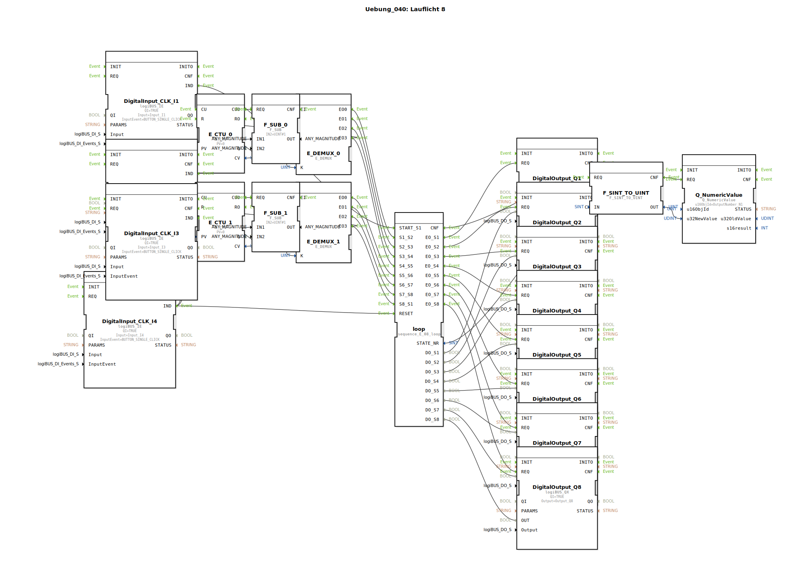

# Uebung_040: Lauflicht 8

Dieser Artikel beschreibt die logiBUS®-Übung `Uebung_040`. Hier wird eine raffinierte Methode gezeigt, um eine 8-stufige Schrittkette mit nur wenigen Tastern manuell durchzuschalten.

## 📺 Video

* [From 1,400 errors to zero](https://www.youtube.com/watch?v=jBk9Y-EX8zE)

## 🎧 Podcast

* [Von 1400 Fehlern zum sauberen Code: Die Migration der „Getreidehacke“ auf Eclipse 4diac™ 3.0 und die Macht der AX-Adapter](https://podcasters.spotify.com/pod/show/logibus/episodes/Von-1400-Fehlern-zum-sauberen-Code-Die-Migration-der-Getreidehacke-auf-Eclipse-4diac-3-0-und-die-Macht-der-AX-Adapter-e3ahcko)
* [400 Millionen Tonnen Agrar-Logistik digitalisieren](https://podcasters.spotify.com/pod/show/ms-muc-lama/episodes/400-Millionen-Tonnen-Agrar-Logistik-digitalisieren-e3b8o5m)
* [Schlüter 1500 Spezial: Turbo-Giftigkeit, 40 Jahre und die Seele eines Kraftprotzes](https://podcasters.spotify.com/pod/show/ms-muc-lama/episodes/Schlter-1500-Spezial-Turbo-Giftigkeit--40-Jahre-und-die-Seele-eines-Kraftprotzes-e39au2l)

----

## Ziel der Übung

Kombination von Ereignis-Zählern (`E_CTU`) und Ereignis-Demultiplexern (`E_DEMUX`) zur Steuerung einer Ablaufkette.

-----

## Beschreibung und Komponenten

[cite_start]Die Subapplikation `Uebung_040.SUB` nutzt zwei Zähler-Zweige, um die Ereignis-Eingänge des Sequenzers `sequence_E_08_loop` zu bedienen[cite: 1].

### Funktionsweise

1.  **Start**: Taster **I1** setzt die Kette auf Anfang (Schritt 1).
2.  **Steppen 1-4**: Jeder Klick auf Taster **I2** erhöht den ersten Zähler. Der Demultiplexer leitet das Klick-Event nacheinander an die Eingänge `S1_S2`, `S2_S3` etc. weiter. Der Nutzer "klickt" sich also durch die ersten vier Phasen.
3.  **Steppen 5-8**: Taster **I3** übernimmt analog die Steuerung für die zweite Hälfte der Kette.
4.  **Zähler-Reset**: Sobald ein Demultiplexer den letzten Ausgang erreicht hat, setzt er seinen zugehörigen Zähler automatisch wieder auf Null zurück.

Dies ist eine sehr effiziente Methode, um komplexe manuelle Abläufe auf kleinstem Raum (wenige Bedienelemente) abzubilden.