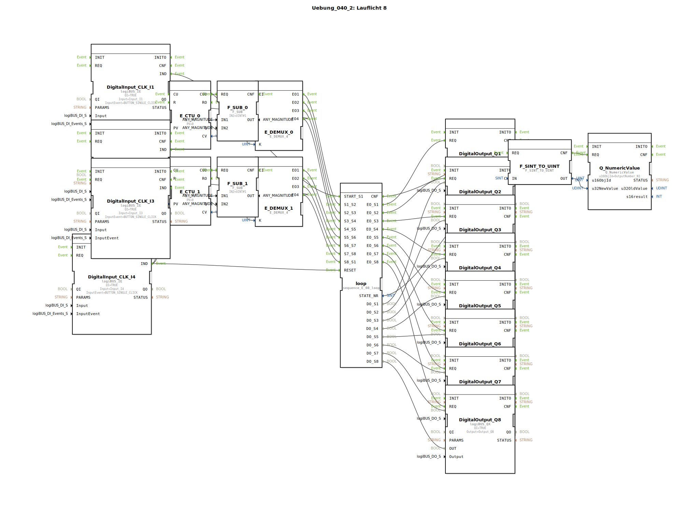

Hier ist die Dokumentation für die Übung `Uebung_040_2` basierend auf den bereitgestellten XML-Daten.

# Uebung_040_2: Lauflicht 8

* * * * * * * * * *

## Einleitung
Diese Übung implementiert ein **8-Kanal-Lauflicht**, welches manuell über Taster gesteuert wird. Im Gegensatz zu einem automatisch ablaufenden Lauflicht, wird hier der Fortschritt der Sequenz durch Benutzerinteraktion bestimmt. Das System ist in zwei Blöcke aufgeteilt, die jeweils 4 Schritte steuern, und beinhaltet eine visuelle Rückmeldung über den aktuellen Status sowie eine numerische Anzeige des aktiven Schritts.

## Verwendete Funktionsbausteine (FBs)

In dieser Übung werden verschiedene Standard- und Spezialbausteine verwendet, um die Logik, die Ein-/Ausgabe und die Sequenzsteuerung zu realisieren.

### Sub-Bausteine: sequence_E_08_loop
Dies ist der zentrale Baustein zur Steuerung der Zustände des Lauflichts.

- **Typ**: `logiBUS::utils::sequence::event::sequence_E_08_loop`
- **Verwendete interne FBs**: (Angenommen basierend auf der Schnittstelle)
    - **Interne Logik**: Zustandsautomat (State Machine)
- **Funktionsweise**:
    Dieser Baustein verwaltet 8 sequentielle Zustände (S1 bis S8). Er verfügt über Ereigniseingänge, um spezifische Übergänge auszulösen (z.B. `S1_S2` für den Wechsel von Schritt 1 zu 2).
    - **Eingänge**: `START_S1` (Initialisierung), `RESET` (Zurücksetzen), sowie diverse Übergangstrigger (`S1_S2`, `S2_S3`, etc.).
    - **Ausgänge**: Für jeden Zustand gibt es ein Ereignis (`EO_S1`..`EO_S8`) und ein Datensignal (`DO_S1`..`DO_S8`), welche die physikalischen Ausgänge steuern. Zusätzlich wird die aktuelle Zustandsnummer (`STATE_NR`) ausgegeben.

### Sub-Bausteine: Logik-Cluster (Zähler & Demultiplexer)
Um die manuellen Tasterdrücke in die korrekten Zustandsübergänge umzuwandeln, wird eine Kombination aus Zählern, Subtrahierern und Demultiplexern verwendet. Dies kommt zweimal vor (für die erste und zweite Hälfte der Sequenz).

- **Typ**: Kombination aus Standard-IEC61499/61131 Bausteinen
- **Verwendete interne FBs**:
    - **E_CTU** (`iec61499::events::E_CTU`): Aufwärtszähler. Zählt die Tasterdrücke.
    - **F_SUB** (`iec61131::arithmetic::F_SUB`): Subtrahierer. Zieht vom Zählerwert 1 ab, um einen 0-basierten Index für den Demultiplexer zu erhalten.
    - **E_DEMUX_4** (`iec61499::events::E_DEMUX_4`): Demultiplexer. Leitet das Eingangssignal basierend auf dem Index `K` an einen von 4 Ausgängen weiter.
- **Funktionsweise**:
    Ein Tasterdruck erhöht den Zähler. Der Wert wird angepasst (Schritt 1 wird zu Index 0) und steuert den Demultiplexer. Dieser feuert das entsprechende Event, um den `sequence_E_08_loop` Baustein in den nächsten Zustand zu schalten.

### Weitere Bausteine
- **logiBUS_QX (DigitalOutput_Q1 - Q8)**: Repräsentieren die 8 Lampen/LEDs des Lauflichts.
- **logiBUS_IE (DigitalInput_CLK_I1 - I4)**: Repräsentieren die Eingabetaster.
    - `I1`: Start / Initialisierung.
    - `I2`: Weiterschalten Schritte 1-4.
    - `I3`: Weiterschalten Schritte 5-8.
    - `I4`: Reset.
- **Q_NumericValue**: Zeigt den aktuellen Schritt (1-8) auf dem Display an.
- **F_SINT_TO_UINT**: Konvertiert den Datentyp der Zustandsnummer für die Anzeige.

## Programmablauf und Verbindungen

Das Programm ist darauf ausgelegt, eine geführte Sequenz von 8 Schritten abzubilden.

1.  **Start und Reset**:
    - Über den Taster **I1** (`START_S1`) wird das Lauflicht gestartet (Zustand 1 aktiv, Q1 leuchtet).
    - Über den Taster **I4** (`RESET`) kann das System jederzeit zurückgesetzt werden. Dies setzt sowohl den Sequenz-Baustein als auch die Zähler (`E_CTU_0`, `E_CTU_1`) zurück.

2.  **Sequenzsteuerung Teil 1 (Schritte 1 bis 5)**:
    - Der Taster **I2** ist für die ersten vier Übergänge zuständig.
    - Bei jedem Klick zählt `E_CTU_0` hoch.
    - Der Demultiplexer `E_DEMUX_0` verteilt diese Ereignisse nacheinander an die Eingänge `S1_S2`, `S2_S3`, `S3_S4` und `S4_S5` des Loop-Bausteins.
    - Wenn der 4. Schritt erreicht ist (Ausgang EO4 des Demux), wird der Zähler automatisch zurückgesetzt.

3.  **Sequenzsteuerung Teil 2 (Schritte 5 bis 1)**:
    - Der Taster **I3** übernimmt die Steuerung für die zweite Hälfte.
    - Er steuert über `E_CTU_1` und `E_DEMUX_1` die Übergänge `S5_S6`, `S6_S7`, `S7_S8` und schließlich `S8_S1` (zurück zum Anfang).

4.  **Ausgabe**:
    - Der `sequence_E_08_loop` Baustein aktiviert je nach internem Zustand genau einen der Ausgänge **Q1 bis Q8**.
    - Gleichzeitig wird die aktuelle Zustandsnummer (`STATE_NR`) über den Konverter `F_SINT_TO_UINT` an das Display-Element `OutputNumber_N1` gesendet, um dem Benutzer den aktuellen Schritt anzuzeigen.

**Lernziele**:
- Verständnis von Zustandsautomaten (Sequencern).
- Nutzung von Zählern und Demultiplexern zur Ereignissteuerung.
- Aufteilung von Steuerungsaufgaben auf verschiedene Eingänge.
- Umgang mit Datentypkonvertierung.

## Zusammenfassung
Die Übung `Uebung_040_2` demonstriert ein komplexes, manuell getaktetes Lauflicht. Durch die Verwendung eines dedizierten Sequenz-Bausteins (`sequence_E_08_loop`) wird die Logik der Zustände sauber gekapselt, während die externe Beschaltung mit Zählern und Demultiplexern eine flexible Eingabesteuerung über mehrere Taster ermöglicht. Das Ergebnis ist eine robust steuerbare Lichtsequenz mit visueller Statusanzeige.