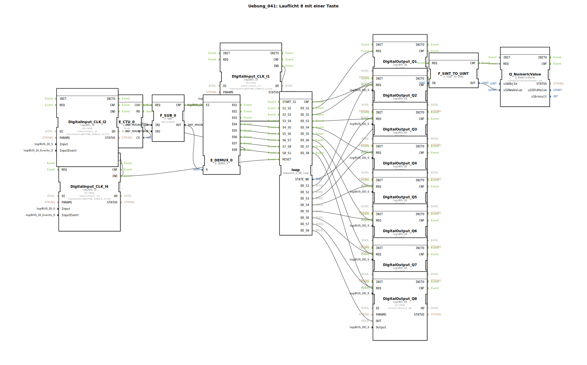

# Uebung_041: Lauflicht 8 mit einer Taste

Dieser Artikel beschreibt die logiBUS®-Übung `Uebung_041`. Hier wird die manuelle Steuerung einer 8-stufigen Schrittkette auf einen einzigen Taster reduziert.

----

## Ziel der Übung

Optimierung der Bedienlogik aus Übung 040. Es wird gezeigt, wie man durch die Kombination von Zähler (`E_CTU`) und Demultiplexer (`E_DEMUX_8`) alle Phasen einer Schrittkette mit nur einer einzigen Taste nacheinander durchschalten kann.

-----

## Beschreibung und Komponenten

[cite_start]In `Uebung_041.SUB` wird ein zentraler Ereignispfad genutzt, um den Sequenzer `sequence_E_08_loop` anzusteuern[cite: 1].

### Funktionsbausteine (FBs)

  * **`I1` (Start)**: Setzt die Sequenz auf den ersten Schritt.
  * **`I2` (Step)**: Der einzige Taster zum Weiterschalten.
  * **`E_CTU_0`**: Zählt die Klicks auf `I2`.
  * **`E_DEMUX_0`**: Leitet das Klick-Ereignis basierend auf dem Zählerstand an den passenden Transitions-Eingang der Schrittkette weiter.
  * **`I4` (Reset)**: Löscht sowohl die Schrittkette als auch den Zähler.

-----

## Funktionsweise

1.  **Initialisierung**: Ein Klick auf **I1** startet das Lauflicht bei `Q1`.
2.  **Manueller Durchlauf**: Jeder Klick auf **I2** erhöht den internen Zähler. Der Demultiplexer sorgt dafür, dass das erste Event an `S1_S2` geht, das zweite an `S2_S3` und so weiter.
3.  **Überlauf**: Nach dem 8. Schritt setzt sich die Logik automatisch zurück und beginnt (beim nächsten Klick) wieder von vorn.

Dies ermöglicht eine vollständige Prozesskontrolle mit minimaler Hardware-Anforderung.

-----

## Anwendungsbeispiel

**Sequenzielle Menüführung**:
Ein einziger Knopf am Joystick dient zum Durchblättern von 8 verschiedenen Betriebsmodi. Jede Betätigung schaltet eine Stufe weiter und aktiviert den entsprechenden Aktor oder Parameter-Satz.