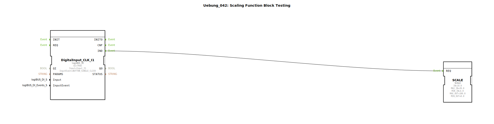

# Uebung_042: Scaling Function Block Testing

Dieser Artikel beschreibt die logiBUS®-Übung `Uebung_042`. Hier wird die mathematische Umrechnung von Wertebereichen demonstriert.

----

## Ziel der Übung

Verwendung des Bausteins `SCALE`. In der Automatisierungstechnik müssen Rohwerte (z.B. 4-20 mA) oft in physikalische Größen (z.B. 0-10 Bar) umgerechnet werden. Der Scale-Baustein übernimmt diese lineare Abbildung.

-----

## Beschreibung und Komponenten

[cite_start]In `Uebung_042.SUB` wird ein Test-Szenario für den Skalierungs-Baustein aufgebaut[cite: 1].

### Funktionsbausteine (FBs)

  * **`SCALE`**: Der Umrechnungs-Baustein.
  * **Parameter**:
    * `MIN_IN` / `MAX_IN`: Der Quell-Bereich (hier 4.0 bis 20.0).
    * `MIN_OUT` / `MAX_OUT`: Der Ziel-Bereich (hier 0.0 bis 100.0).
    * `IN`: Der aktuelle Eingangswert (hier fest auf 10.0 gesetzt).

-----

## Funktionsweise

Sobald das Ereignis `REQ` (hier durch Taster **I1** ausgelöst) eintrifft, berechnet der Baustein die Position des Eingangswerts im Quell-Bereich und bildet diese proportional auf den Ziel-Bereich ab.
Bei `IN = 10.0` (genau in der Mitte zwischen 4 und 20 ist es nicht ganz, aber mathematisch definiert) liefert der Baustein das entsprechende Ergebnis am Ausgang.

-----

## Anwendungsbeispiel

**Sensorkalibrierung**:
Ein Drucksensor liefert Werte zwischen 400 (Vakuum) und 2000 (Maximaldruck). Für die Anzeige am Terminal soll dies als 0% bis 100% dargestellt werden. Der `SCALE`-Baustein übernimmt diese Aufgabe, sodass die Logik immer mit intuitiven Prozentwerten arbeiten kann.