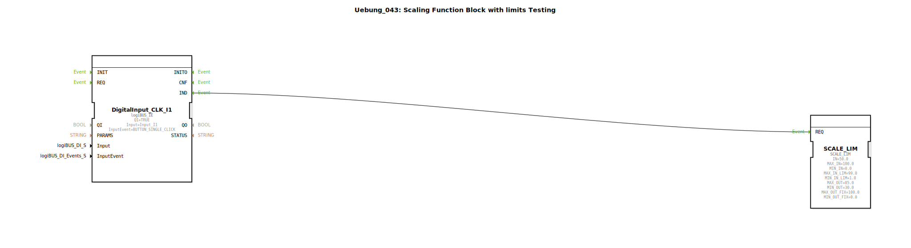

# Uebung_043: Scaling Function Block with limits Testing

Dieser Artikel beschreibt die logiBUS®-Übung `Uebung_043`. Dies ist eine Erweiterung der Skalierung um Sicherheitsgrenzen.

----

## Ziel der Übung

Verwendung des Bausteins `SCALE_LIM`. Im Gegensatz zum einfachen `SCALE` bietet dieser Baustein zusätzliche Parameter, um das Ergebnis nach oben und unten zu begrenzen (Limiting), selbst wenn der Eingangswert den definierten Bereich verlässt.

-----

## Beschreibung und Komponenten

[cite_start]In `Uebung_043.SUB` wird ein hochkomplexer Skalierungs-Szenario mit fixen Grenzen aufgebaut[cite: 1].

### Funktionsbausteine (FBs)

  * **`SCALE_LIM`**: Skalierung mit Sättigung.
  * **Parameter**:
    * `MIN_IN_LIM` / `MAX_IN_LIM`: Definieren den Bereich, in dem der Eingangswert "gültig" ist.
    * `MIN_OUT_FIX` / `MAX_OUT_FIX`: Harte Grenzwerte für den Ausgang. Egal was berechnet wird, der Ausgang wird diese Werte niemals unter- oder überschreiten.

-----

## Anwendungsbeispiel

**Überlaufschutz bei der Ventilsteuerung**:
Ein Regler berechnet die Öffnung eines Ventils basierend auf der Temperatur. Auch wenn der Regler aufgrund einer extremen Störung "150%" anfordert, sorgt `SCALE_LIM` dafür, dass der reale Ausgangswert bei 100% gekappt wird, um die Hardware nicht zu beschädigen. Ebenso kann eine Mindestöffnung (z.B. 5% zur Kühlung) fest als Untergrenze hinterlegt werden.