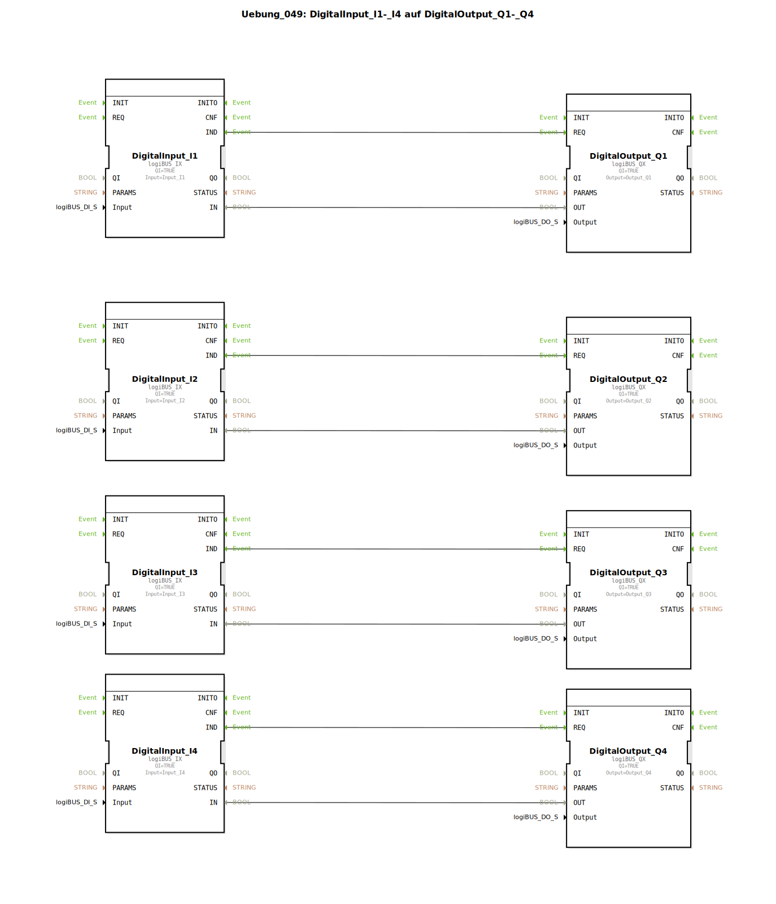

# Uebung_049: DigitalInput_I1-_I4 auf DigitalOutput_Q1-_Q4

Dieser Artikel beschreibt die logiBUS®-Übung `Uebung_049`. Diese Übung dient der Übung von umfangreichen Punkt-zu-Punkt-Verbindungen.

## 🎧 Podcast

* [4diac IDE: Wie der IEC 61499 Standard die Industrieautomatisierung revolutioniert](https://podcasters.spotify.com/pod/show/eclipse-4diac-de/episodes/4diac-IDE-Wie-der-IEC-61499-Standard-die-Industrieautomatisierung-revolutioniert-e36756a)
* [IEC 61499 vs. 61131: Brauchen wir einen neuen Standard für IIoT? Analyse einer hitzigen Debatte um Verteilte Intelligenz](https://podcasters.spotify.com/pod/show/iec-61499-grundkurs-de/episodes/IEC-61499-vs--61131-Brauchen-wir-einen-neuen-Standard-fr-IIoT--Analyse-einer-hitzigen-Debatte-um-Verteilte-Intelligenz-e3ahc2r)
* [IEC 61499: Befreit der neue Standard die Industrieautomation? Ein Vergleich mit 61131 und die Brücke zwischen OT & IT.](https://podcasters.spotify.com/pod/show/iec-61499-grundkurs-de/episodes/IEC-61499-Befreit-der-neue-Standard-die-Industrieautomation--Ein-Vergleich-mit-61131-und-die-Brcke-zwischen-OT--IT-e368446)
* [IEC 61499: Revolution der Industrieautomation – Warum der neue Standard Ihre Systeme fit für die Zukunft macht](https://podcasters.spotify.com/pod/show/iec-61499-grundkurs-de/episodes/IEC-61499-Revolution-der-Industrieautomation--Warum-der-neue-Standard-Ihre-Systeme-fit-fr-die-Zukunft-macht-e375evm)
* [4diac IDE: Dein Open-Source-Werkzeugkasten für verteilte Industrieautomatisierung nach IEC 61499](https://podcasters.spotify.com/pod/show/eclipse-4diac-de/episodes/4diac-IDE-Dein-Open-Source-Werkzeugkasten-fr-verteilte-Industrieautomatisierung-nach-IEC-61499-e36821e)

----

## Übersicht

[cite_start]In `Uebung_049.SUB` werden vier digitale Eingänge (`I1` bis `I4`) direkt auf vier digitale Ausgänge (`Q1` bis `Q4`) gemappt[cite: 1]. Dies ist die Basisform der Signalweiterleitung ohne Logik oder Strukturierung, bei der jeder Kanal über eigene Event- und Data-Connections verfügt. Es dient primär dem Training der manuellen Verdrahtung in der 4diac-IDE.