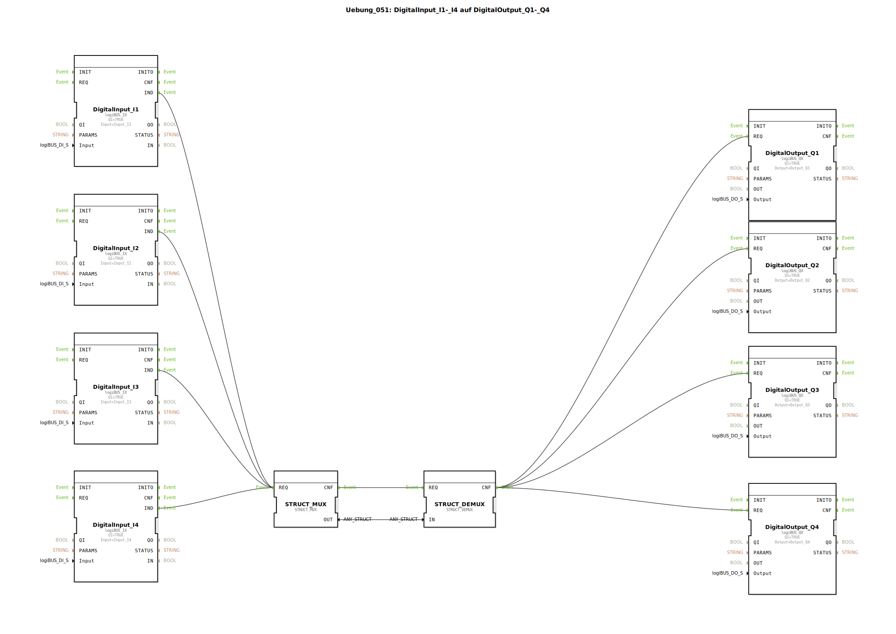

# Uebung_051: DigitalInput_I1-_I4 auf DigitalOutput_Q1-_Q4

Dieser Artikel beschreibt die logiBUS®-Übung `Uebung_051`. Hier wird gezeigt, wie man viele Einzelsignale zu einem Paket (Struktur) zusammenfasst, um sie effizienter durch das Programm zu leiten.

## 🎧 Podcast

* [Automatisierung entschlüsselt: Leiten, Steuern, Regeln – Die unsichtbare Sprache der Technik (DIN IEC 60050-351)](https://podcasters.spotify.com/pod/show/ms-muc-lama/episodes/Automatisierung-entschlsselt-Leiten--Steuern--Regeln--Die-unsichtbare-Sprache-der-Technik-DIN-IEC-60050-351-e36t52b)
* [Infineon CAN-Transceiver TLE9250V versus TLE9351VSJ](https://podcasters.spotify.com/pod/show/ms-muc-lama/episodes/Infineon-CAN-Transceiver-TLE9250V-versus-TLE9351VSJ-e3b8nan)
* [Infineon TLE9351VSJ der unsichtbare Auto-Bodyguard](https://podcasters.spotify.com/pod/show/ms-muc-lama/episodes/Infineon-TLE9351VSJ-der-unsichtbare-Auto-Bodyguard-e3b8nhl)
* [Land- und Forstwirtschaft 4.0: Das Fundament der Sicherheit – Analyse der DIN EN ISO 25119-1 und der](https://podcasters.spotify.com/pod/show/ms-muc-lama/episodes/Land--und-Forstwirtschaft-4-0-Das-Fundament-der-Sicherheit--Analyse-der-DIN-EN-ISO-25119-1-und-der-e39kn2f)

----

## Ziel der Übung

Verwendung von `STRUCT_MUX` und `STRUCT_DEMUX`. In großen Systemen ist es unübersichtlich, hunderte Einzelkabel zu ziehen. Stattdessen werden Signale gebündelt ("gemultiplext"), über eine einzige Verbindung transportiert und am Zielort wieder entpackt.

-----

## Beschreibung und Komponenten

[cite_start]Die Subapplikation `Uebung_051.SUB` nutzt strukturierte Datentypen zur Signalübertragung[cite: 1].

### Funktionsbausteine (FBs)

  * **`STRUCT_MUX`**: Packt 4 einzelne Digitalsignale in einen strukturierten Datentyp (hier `ST04X`).
  * **`STRUCT_DEMUX`**: Entnimmt der Struktur wieder die 4 Einzelsignale.

-----

## Funktionsweise

1.  Die vier Taster liefern ihre Signale an die Eingänge `X_00` bis `X_03` des MUX.
2.  Ein Klick auf einen beliebigen Taster triggert den `REQ` des MUX.
3.  Der MUX erstellt ein Datenpaket (`OUT`), das alle 4 Zustände gleichzeitig enthält.
4.  Über eine **einzige** Datenverbindung wandert dieses Paket zum DEMUX.
5.  Der DEMUX zerlegt das Paket wieder und steuert die vier Lampen `Q1` bis `Q4` an.

Dies reduziert die Anzahl der Verbindungsleitungen im Hauptprogramm massiv und erhöht die Übersichtlichkeit.

-----

## Anwendungsbeispiel

**Kabelbaum-Abstraktion**:
Stellen Sie sich vor, 16 Sensoren am Heck einer Maschine müssen zur Kabine geleitet werden. In der Software werden diese 16 Signale im Heck zu einer Struktur "Heck_Sensoren" zusammengefasst. Nur diese eine Struktur wird durch die Programmlogik bis zur Kabinen-Ansicht gereicht, wo sie dann wieder in Einzelwerte für das Display zerlegt wird.