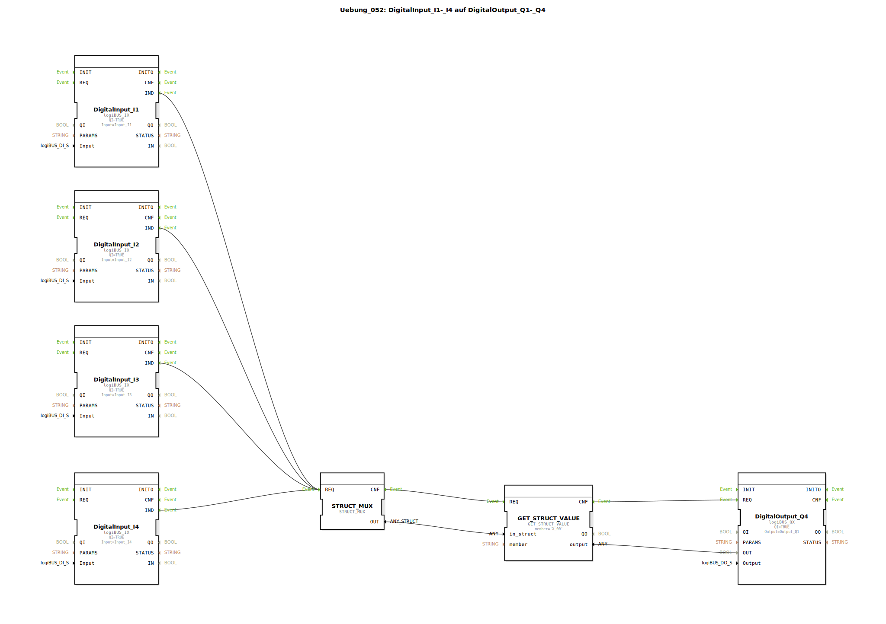

# Uebung_052: DigitalInput_I1-_I4 auf DigitalOutput_Q1-_Q4

Dieser Artikel beschreibt die logiBUS®-Übung `Uebung_052`.

----

## Übersicht

[cite_start]In dieser Variante wird gezeigt, wie man ein einzelnes Signal aus einer Struktur extrahiert, ohne alle Kanäle auspacken zu müssen[cite: 1].
Über den Baustein `GET_STRUCT_VALUE` und den Parameter `member = 'X_00'` wird gezielt nur der erste Kanal aus dem Datenpaket der Übung 051 abgegriffen und auf den Ausgang `Q4` gelegt. Dies ist nützlich, wenn in einem Modul nur eine bestimmte Information aus einem großen Datenbündel benötigt wird.

