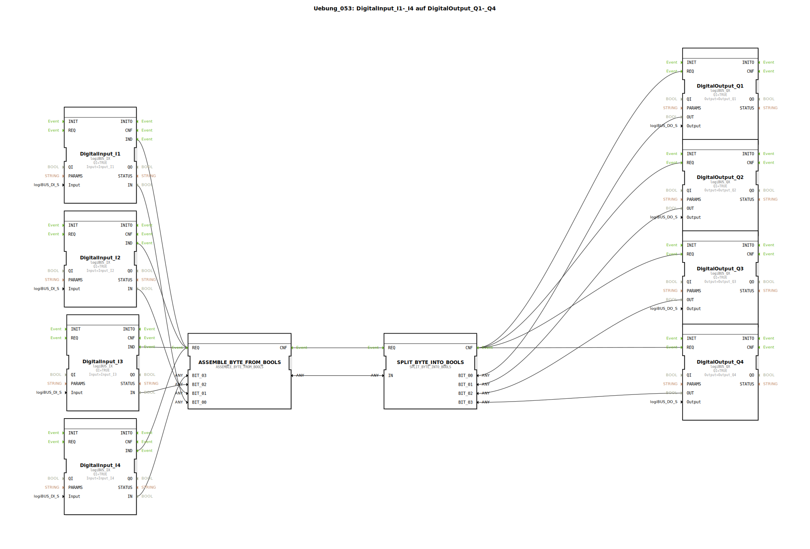

# Uebung_053: DigitalInput_I1-_I4 auf DigitalOutput_Q1-_Q4

Dieser Artikel beschreibt die logiBUS®-Übung `Uebung_053`.

----

## Ziel der Übung

Kombination von Bits zu einem Byte. Dies ist eine hardwarenahe Form der Bündelung, wie sie oft bei der Kommunikation mit Feldbus-Teilnehmern (z.B. CAN-Bus Nachrichten) vorkommt.

-----

## Beschreibung und Komponenten

[cite_start]Die Subapplikation `Uebung_053.SUB` nutzt Konvertierungs-Bausteine für den Datentyp `BYTE`[cite: 1].

### Funktionsbausteine (FBs)

  * **`ASSEMBLE_BYTE_FROM_BOOLS`**: Wandelt 8 Einzelbits (hier werden 4 genutzt) in einen 8-Bit Ganzzahlwert (BYTE) um.
  * **`SPLIT_BYTE_INTO_BOOLS`**: Zerlegt das Byte wieder in seine einzelnen Bits.

-----

## Funktionsweise

Das Prinzip entspricht Übung 051, jedoch wird anstelle einer Software-Struktur ein standardisierter numerischer Datentyp (`BYTE`) als Container genutzt. Dies ist die effizienteste Form der Datenübertragung, da sie den Speicherverbrauch im Netzwerk minimiert.