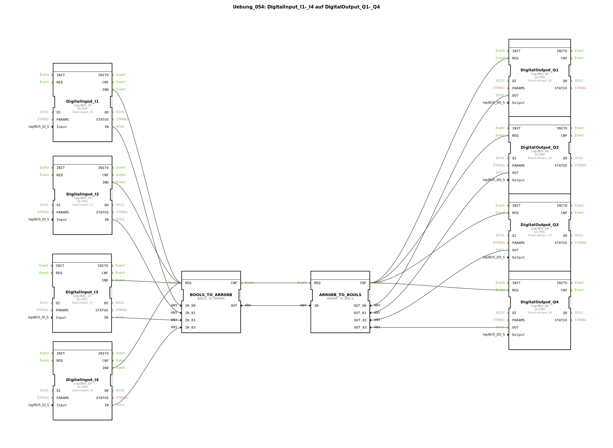

# Uebung_054: DigitalInput_I1-_I4 auf DigitalOutput_Q1-_Q4

Dieser Artikel beschreibt die logiBUS®-Übung `Uebung_054`. Dies ist die dritte Methode der Signalbündelung: Die Verwendung von Feldern (Arrays).

----

## Ziel der Übung

Verwendung von `BOOLS_TO_ARR08X` und `ARR08X_TO_BOOLS`.

-----

## Beschreibung

[cite_start]In `Uebung_054.SUB` werden vier Digitalsignale in ein Array (eine indizierte Liste von Werten) verpackt[cite: 1].
Im Gegensatz zur Struktur (wo jeder Kanal einen Namen hat, z.B. `X_00`) greift man bei einem Array über die Position (Index 0 bis 7) auf die Daten zu. Dies ist besonders vorteilhaft, wenn Signalpfade in Programmschleifen verarbeitet werden sollen.

