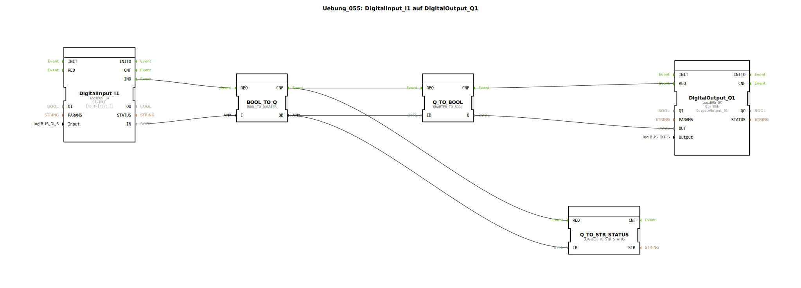

# Uebung_055: DigitalInput_I1 auf DigitalOutput_Q1

Dieser Artikel beschreibt die logiBUS®-Übung `Uebung_055`. Hier wird ein zentrales logiBUS-Konzept zur Übertragung von erweiterten Status-Informationen eingeführt: Das "Quarter" (2-Bit Information).

----

## Ziel der Übung

Verständnis von erweiterten Signalzuständen. In professionellen Steuerungen reicht ein einfaches "An/Aus" oft nicht aus. Man möchte auch wissen, ob ein Signal ungültig ist oder ein Fehler vorliegt. Ein "Quarter" nutzt 2 Bit pro Kanal, um vier Zustände darzustellen (z.B. Aus, An, Fehler, Nicht Verfügbar).

-----

## Beschreibung und Komponenten

[cite_start]Die Subapplikation `Uebung_055.SUB` demonstriert die Wandlung zwischen einfachen booleschen Werten und logiBUS-Quartalen[cite: 1].

### Funktionsbausteine (FBs)

  * **`BOOL_TO_Q`**: Wandelt ein Standard-Bit in ein 2-Bit Quartal um.
  * **`Q_TO_BOOL`**: Extrahiert das Haupt-Signal (An/Aus) wieder aus dem Quartal.
  * **`QUARTER_TO_STR_STATUS`**: Wandelt den 2-Bit Code in einen lesbaren Text um (z.B. "STATUS_OFF", "STATUS_ON").

-----

## Funktionsweise

Das System reichert die Information an:
1.  Der Taster `I1` liefert ein einfaches `TRUE/FALSE`.
2.  `BOOL_TO_Q` macht daraus ein Quartal (z.B. FALSE ➡️ 00, TRUE ➡️ 01).
3.  Dieses Paket (`QB`) kann nun durch das Programm geleitet werden.
4.  Am Ende wird es wieder zerlegt: Die Lampe `Q1` erhält nur das An/Aus-Bit, während ein Diagnose-Baustein gleichzeitig den Textstatus ("ON") ermittelt.

Dies bildet die Grundlage für moderne Diagnose-Systeme in der Landtechnik.