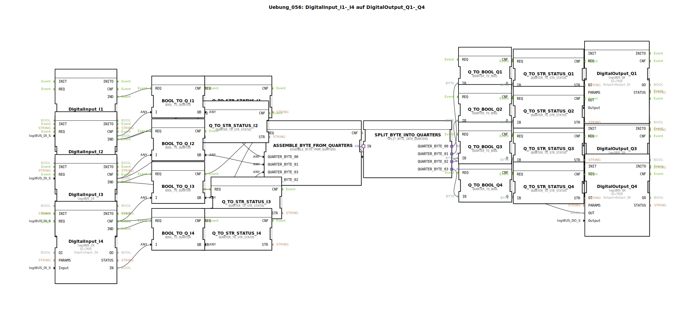

# Uebung_056: DigitalInput_I1-_I4 auf DigitalOutput_Q1-_Q4

Dieser Artikel beschreibt die logiBUS®-Übung `Uebung_056`. Hier wird das Quarter-Konzept auf eine vierkanalige Struktur erweitert.

----

## Übersicht

[cite_start]Die Subapplikation `Uebung_056.SUB` zeigt eine vollständige Diagnose-Pipeline[cite: 1]:

1.  **Eingabe**: Vier Taster (`I1`-`I4`) werden in Quartale gewandelt.
2.  **Bündelung**: Vier Quartale (4 x 2 Bit = 8 Bit) werden über den Baustein `ASSEMBLE_BYTE_FROM_QUARTERS` zu einem einzigen Byte zusammengefasst.
3.  **Transport**: Das Byte wird als Paket übertragen.
4.  **Zerlegung**: `SPLIT_BYTE_INTO_QUARTERS` gewinnt die Information zurück.
5.  **Ausgabe & Diagnose**: Die Signale steuern vier Lampen, während parallel für **jeden** Kanal ein Klartext-Status für das Terminal generiert wird.

Dies ist das Standard-Verfahren für die Übertragung von Sektions-Zuständen (z.B. bei einer Feldspritze) im logiBUS-System.