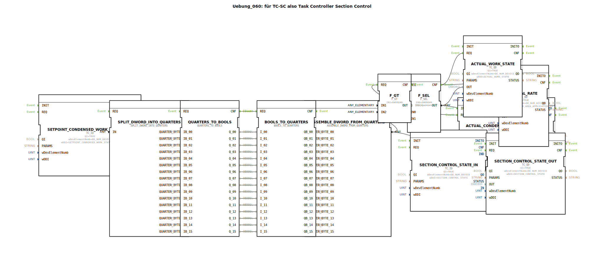

# Uebung_060: für TC-SC also Task Controller Section Control

Dieser Artikel beschreibt die logiBUS®-Übung `Uebung_060`. Dies ist eine High-Level Übung für professionelle ISOBUS-Anwendungen im Bereich des Precision Farming.

## 🎧 Podcast

* [Automatisierung entschlüsselt: Leiten, Steuern, Regeln – Die unsichtbare Sprache der Technik (DIN IEC 60050-351)](https://podcasters.spotify.com/pod/show/ms-muc-lama/episodes/Automatisierung-entschlsselt-Leiten--Steuern--Regeln--Die-unsichtbare-Sprache-der-Technik-DIN-IEC-60050-351-e36t52b)

----

## Ziel der Übung

Anbindung an einen ISOBUS Task Controller (TC). Es wird demonstriert, wie die automatische Teilbreitenschaltung (Section Control) und die Dokumentation von Arbeitszuständen und Ausbringraten realisiert werden.

-----

## Beschreibung und Komponenten

[cite_start]In `Uebung_060.SUB` werden Sollwerte vom Task Controller empfangen und Istwerte zurückgemeldet[cite: 1].

### Funktionsbausteine (FBs)

  * **`TC_ID`**: Empfängt Befehle vom Task Controller des Traktors (z.B. "Schalte Teilbreite 5 ein").
  * **`TC_QD`**: Meldet Daten an den Task Controller zurück (z.B. "Teilbreite 5 ist jetzt tatsächlich aktiv").
  * **Quarter-Logik**: Die Zustände der Teilbreiten werden als Quartale (2-Bit) übertragen, um auch Fehlerzustände (z.B. Kabelbruch am Ventil) an den TC melden zu können.
  * **DDI (Data Dictionary Identifier)**: Spezifische Codes (z.B. `SETPOINT_CONDENSED_WORK_STATE`), die definieren, welche Information gerade übertragen wird.

-----

## Funktionsweise

1.  **Sollwert-Empfang**: Der Task Controller sendet ein DWORD, das die Zustände von 16 Teilbreiten enthält.
2.  **Verarbeitung**: Die Steuerung zerlegt dieses Wort in einzelne Quartale und dann in boolesche Signale für die Ventile (SubApp `Out`).
3.  **Istwert-Rückmeldung**: Die tatsächlichen Zustände der Ventile werden wieder zu einem DWORD zusammengefügt und als "Actual Condensed Work State" an den TC zurückgesendet.
4.  **Arbeitsstatus**: Sobald mindestens eine Teilbreite aktiv ist (`F_GT`), meldet die Steuerung dem TC den "Actual Work State" (Arbeit läuft), woraufhin der TC mit der Flächenaufzeichnung beginnt.

-----

## Anwendungsbeispiel

**Automatische Teilbreitenschaltung bei einer Spritze**:
Der Traktor erkennt per GPS, dass ein Teil des Gestänges über eine bereits behandelte Fläche fährt. Der Task Controller sendet den Befehl "Teilbreite 1-4 AUS". Das logiBUS-Programm empfängt diesen Befehl, schaltet die physischen Magnetventile ab und meldet dem Fahrer am Bildschirm den Erfolg durch den korrekten Ist-Status zurück.