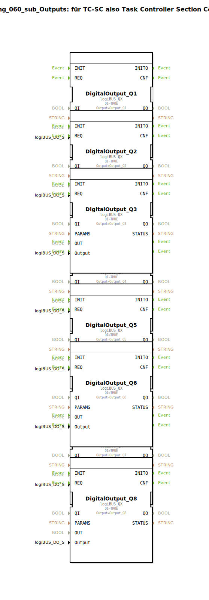

Hier ist die Dokumentation für die Übung `Uebung_060_sub_Outputs` basierend auf den bereitgestellten XML-Daten.

# Uebung_060_sub_Outputs: für TC-SC also Task Controller Section Control

* * * * * * * * * *

## Einleitung

Die Sub-Application **Uebung_060_sub_Outputs** dient als Abstraktionsschicht für die Hardware-Ausgänge. Laut dem internen Kommentar ist dieser Baustein für "TC-SC" (Task Controller Section Control) vorgesehen. Er empfängt logische boolesche Signale und leitet diese an physikalische oder logische LogiBUS-Ausgänge (Digital Outputs) weiter.

Der Baustein mappt eine Reihe von Eingangs-Variablen (`Q_00` bis `Q_08`) auf spezifische Output-Adressen.

## Verwendete Funktionsbausteine (FBs)

In dieser Sub-Application werden mehrere Instanzen des gleichen Bausteintyps verwendet, um die verschiedenen digitalen Ausgänge anzusteuern.

### Sub-Bausteine: DigitalOutput_Q1 bis DigitalOutput_Q8

Es befinden sich 8 Instanzen des Treibertyps im Netzwerk, die die Signale an die Hardware weiterleiten. Da der Aufbau für alle Instanzen identisch ist (bis auf den zugewiesenen Ausgang), werden sie hier zusammengefasst beschrieben.

- **Typ**: `logiBUS::io::DQ::logiBUS_QX`
- **Verwendete interne FBs**:
    - **DigitalOutput_Q1 bis DigitalOutput_Q8**: `logiBUS::io::DQ::logiBUS_QX`
        - **Parameter**:
            - `QI`: `TRUE` (Baustein ist dauerhaft aktiviert)
            - `Output`: Entspricht dem jeweiligen Hardware-Ausgang (z.B. `Output_Q1` für Instanz Q1, `Output_Q2` für Instanz Q2, usw.)
        - **Ereigniseingang**: `REQ` (Ausgelöst durch das externe Ereignis `CNF`)
        - **Dateneingang**: `OUT` (Verbunden mit den externen Eingängen `Q_00` bis `Q_07`)
- **Funktionsweise**:
    Diese Bausteine fungieren als Treiber für das LogiBUS-System. Sobald ein Ereignis am Eingang `REQ` eintrifft, wird der Wert, der am Dateneingang `OUT` anliegt, auf den konfigurierten physikalischen Ausgang (`Output`-Parameter) geschrieben.

## Programmablauf und Verbindungen

Der Ablauf innerhalb der Sub-Application ist rein ereignisgesteuert und dient der direkten Signalweiterleitung (Mapping).

1.  **Ereignisverarbeitung (`CNF`)**:
    *   Das Hauptereignis `CNF` (Confirmation) am Eingang der Sub-Application triggert den `REQ`-Eingang aller 8 enthaltenen DigitalOutput-Bausteine (`DigitalOutput_Q1` bis `DigitalOutput_Q8`).
    *   Dies sorgt dafür, dass alle Ausgänge im gleichen Zyklus aktualisiert werden.

2.  **Datenmapping**:
    Die Eingangsvariablen werden mit einem Index-Versatz auf die Ausgänge gelegt:
    *   Eingang `Q_00` steuert `DigitalOutput_Q1` (Ausgang 1).
    *   Eingang `Q_01` steuert `DigitalOutput_Q2` (Ausgang 2).
    *   Eingang `Q_02` steuert `DigitalOutput_Q3` (Ausgang 3).
    *   Eingang `Q_03` steuert `DigitalOutput_Q4` (Ausgang 4).
    *   Eingang `Q_04` steuert `DigitalOutput_Q5` (Ausgang 5).
    *   Eingang `Q_05` steuert `DigitalOutput_Q6` (Ausgang 6).
    *   Eingang `Q_06` steuert `DigitalOutput_Q7` (Ausgang 7).
    *   Eingang `Q_07` steuert `DigitalOutput_Q8` (Ausgang 8).

    *Hinweis:* Die Variable `Q_08` ist in der Schnittstelle definiert, wird aber im internen Netzwerk laut vorliegender Konfiguration nicht weiterverbunden.

## Zusammenfassung

Die `Uebung_060_sub_Outputs` stellt eine Schnittstellen-Komponente dar, die eine saubere Trennung zwischen der Steuerungslogik und der Hardware-Anbindung ermöglicht. Sie nimmt 8 Steuersignale (`Q_00` - `Q_07`) entgegen und mappt diese auf die LogiBUS-Ausgänge 1 bis 8. Dies erleichtert die Wiederverwendbarkeit des Codes und die Übersichtlichkeit bei der Ansteuerung von Sektoren (Section Control).

## 🛠️ Zugehörige Übungen

* [Uebung_060](Uebung_060.md)

