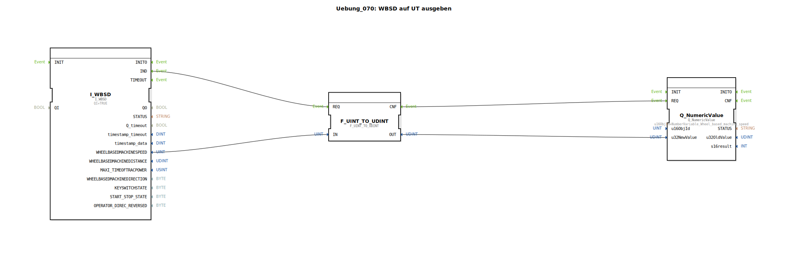

# Uebung_070: WBSD auf UT ausgeben

Dieser Artikel beschreibt die logiBUS®-Übung `Uebung_070`. Hier wird gezeigt, wie man Daten von der Traktor-ECU (TECU) einliest und auf dem Terminal visualisiert.

## 🎧 Podcast

* [Der BTS7030-2EPA intelligenter Auto Stromwächter](https://podcasters.spotify.com/pod/show/ms-muc-lama/episodes/Der-BTS7030-2EPA-intelligenter-Auto-Stromwchter-e3b8n3s)
* [Der Intelligente Leistungsschalter: Wie der Infineon BTS7030 Relais und Sicherungen im Auto ersetzt](https://podcasters.spotify.com/pod/show/ms-muc-lama/episodes/Der-Intelligente-Leistungsschalter-Wie-der-Infineon-BTS7030-Relais-und-Sicherungen-im-Auto-ersetzt-e39av14)
* [Infineon BTS7030-2EPA: Intelligenter High-Side Leistungsschalter](https://podcasters.spotify.com/pod/show/ms-muc-lama/episodes/Infineon-BTS7030-2EPA-Intelligenter-High-Side-Leistungsschalter-e368fl3)
* [JBC Lötspitzen C470 vs. C245 vs. C210 vs. C115: Welche Spitze ist der Allrounder und wann brauchst du den Nano-Spezialisten?](https://podcasters.spotify.com/pod/show/ms-muc-lama/episodes/JBC-Ltspitzen-C470-vs--C245-vs--C210-vs--C115-Welche-Spitze-ist-der-Allrounder-und-wann-brauchst-du-den-Nano-Spezialisten-e39ak58)
* [Verpolungsschutz in der Elektronik: Warum die ideale Diode (LM74700) MOSFETs und Schottky-Dioden in Effizienz und Kosten schlägt](https://podcasters.spotify.com/pod/show/ms-muc-lama/episodes/Verpolungsschutz-in-der-Elektronik-Warum-die-ideale-Diode-LM74700-MOSFETs-und-Schottky-Dioden-in-Effizienz-und-Kosten-schlgt-e3a2487)

----

## Ziel der Übung

Verwendung des Bausteins `I_WBSD` (Wheel Based Speed and Distance). Ziel ist es, die vom Getriebe oder den Rädern des Traktors gemeldete Geschwindigkeit abzugreifen und als numerischen Wert an ein ISOBUS-Terminal zu senden.

-----

## Beschreibung und Komponenten

[cite_start]Die Subapplikation `Uebung_070.SUB` liest die ISOBUS-Nachricht WBSD ein und leitet sie an eine numerische Anzeige weiter[cite: 1].

### Funktionsbausteine (FBs)

  * **`I_WBSD`**: Typ `isobus::tecu::I_WBSD`. [cite_start]Dieser Baustein lauscht auf dem CAN-Bus nach den standardisierten TECU-Nachrichten für radbasierte Geschwindigkeit und Wegstrecke[cite: 1].
  * **`Q_NumericValue`**: Sendet den Wert an das Objekt `NumberVariable_Wheel_based_machine_speed` im Terminal-Pool.

-----

## Funktionsweise

Die TECU sendet die Geschwindigkeitsdaten in festen Zeitintervallen (zyklisch) auf den ISOBUS.
1.  Der Baustein `I_WBSD` empfängt eine neue Nachricht.
2.  Er aktualisiert den Ausgang `WHEELBASEDMACHINESPEED` und feuert ein `IND`-Event.
3.  Das Ereignis triggert die Anzeige am Terminal.
4.  Der Fahrer sieht die aktuelle Geschwindigkeit des Traktors in Echtzeit auf seinem Display.

-----

## Anwendungsbeispiel

**Überwachung der Fahrgeschwindigkeit**:
Bei der Ausbringung von Gülle oder Dünger ist die exakte Einhaltung der Geschwindigkeit entscheidend für die Dosierung. Die Anzeige am Terminal dient dem Fahrer als Kontrolle, ob er im optimalen Bereich fährt.