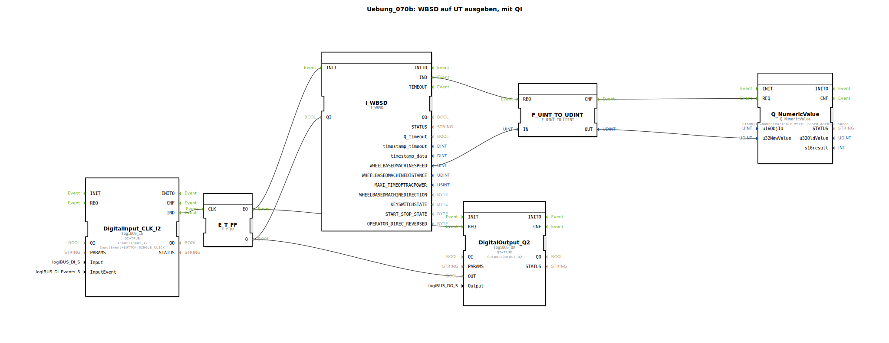

# Uebung_070b: WBSD auf UT ausgeben, mit QI

* * * * * * * * * *
## Einleitung

Diese Übung demonstriert die Ausgabe der radbasierten Maschinengeschwindigkeit (Wheel‑based Machine Speed, WBSD) auf ein ISOBUS‑Universal Terminal (UT). Dabei wird der Qualifier‑Eingang **QI** des WBSD‑Bausteins über einen T‑Flipflop gesteuert, der mit einem Digitaleingang (Taster I2) getoggelt wird. Die Ausgabe des aktuellen Geschwindigkeitswerts erfolgt über den UT‑Baustein **Q_NumericValue**.

## Verwendete Funktionsbausteine (FBs)

- **I_WBSD**  
  – Typ: `isobus::tecu::I_WBSD`  
  – Stellt die radbasierte Maschinengeschwindigkeit als 16‑Bit‑Wert bereit.  
  – Ereignisse: `IND` (Ausgang), `INIT` (Eingang)  
  – Daten: `WHEELBASEDMACHINESPEED` (Ausgang), `QI` (Eingang)

- **Q_NumericValue**  
  – Typ: `isobus::UT::Q::Q_NumericValue`  
  – Zeigt einen numerischen Wert auf dem UT an.  
  – Parameter: `u16ObjId` = `NumberVariable_Wheel_based_machine_speed`  
  – Ereignisse: `REQ` (Eingang)  
  – Daten: `u32NewValue` (Eingang)

- **F_UINT_TO_UDINT**  
  – Typ: `iec61131::conversion::F_UINT_TO_UDINT`  
  – Konvertiert einen 16‑Bit‑Wert in einen 32‑Bit‑Wert.  
  – Ereignisse: `REQ` (Eingang), `CNF` (Ausgang)  
  – Daten: `IN` (Eingang), `OUT` (Ausgang)

- **E_T_FF**  
  – Typ: `iec61499::events::E_T_FF`  
  – T‑Flipflop: Bei jeder steigenden Flanke am Takteingang wird der Ausgangszustand umgeschaltet.  
  – Ereignisse: `CLK` (Eingang), `EO` (Ausgang)  
  – Daten: `Q` (Ausgang)

- **DigitalInput_CLK_I2**  
  – Typ: `logiBUS::io::DI::logiBUS_IE`  
  – Digitaler Eingang (I2) mit Ereignisauslösung bei Tastendruck (BUTTON_SINGLE_CLICK).  
  – Parameter: `QI` = `TRUE`, `Input` = `Input_I2`, `InputEvent` = `BUTTON_SINGLE_CLICK`  
  – Ereignisse: `IND` (Ausgang)

- **DigitalOutput_Q2**  
  – Typ: `logiBUS::io::DQ::logiBUS_QX`  
  – Digitaler Ausgang (Q2).  
  – Parameter: `QI` = `TRUE`, `Output` = `Output_Q2`  
  – Ereignisse: `REQ` (Eingang)  
  – Daten: `OUT` (Eingang)

## Programmablauf und Verbindungen

1. **Eingangssignal**: Der digitale Eingang **I2** wird als Taster genutzt. Bei einem einfachen Klick (Single Click) erzeugt der Baustein `DigitalInput_CLK_I2` ein Ereignis `IND`.
2. **T‑Flipflop**: Dieses Ereignis gelangt an den Takteingang `CLK` des **E_T_FF**. Bei jedem Tastendruck wechselt der Ausgang `Q` seinen Zustand (Toggle).
3. **Steuerung von WBSD und Ausgang Q2**:
   - Der Flipflop‑Ausgang `Q` wird auf den Qualifier‑Eingang `QI` von **I_WBSD** sowie auf den Daten‑Eingang `OUT` des Digitalausgangs **DigitalOutput_Q2** geschaltet.
   - Wenn der Flipflop den Zustand wechselt, wird gleichzeitig das Ereignis `EO` ausgelöst, das sowohl den **I_WBSD** initialisiert (`INIT`) als auch den Digitalausgang aktualisiert (`REQ`).
4. **Wertausgabe**:
   - Der initialisierte **I_WBSD** gibt die aktuelle Geschwindigkeit (16‑Bit) über `WHEELBASEDMACHINESPEED` aus.
   - Dieser Wert wird im Baustein **F_UINT_TO_UDINT** in einen 32‑Bit‑Wert konvertiert.
   - Das Bestätigungsereignis `CNF` des Konverters löst den **Q_NumericValue** aus (`REQ`), der den umgewandelten Wert übernimmt (`u32NewValue`) und auf dem UT anzeigt.

Die Übung veranschaulicht somit die kombinierte Nutzung von Hardware‑Eingang, Flipflop‑Logik und ISOBUS‑Kommunikation zur Erfassung und Anzeige einer Maschinengröße.

## Zusammenfassung

Die Übung **Uebung_070b** zeigt, wie ein digitaler Taster (I2) verwendet wird, um über einen T‑Flipflop die Freigabe (QI) der radbasierten Geschwindigkeit zu steuern. Die gemessene Geschwindigkeit wird auf einem ISOBUS‑Universal Terminal dargestellt. Der Aufbau ist konsistent mit dem Prinzip der Übung **Uebung_094a**. Das Verständnis dieser Schaltung ist grundlegend für Anwendungen, bei denen Maschinendaten zyklisch oder ereignisgesteuert ausgegeben werden sollen.