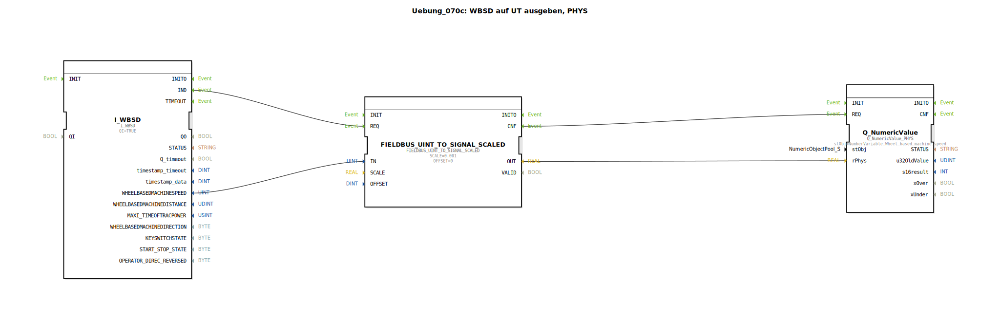

# Uebung_070c: WBSD auf UT ausgeben, PHYS

* * * * * * * * * *
## Einleitung

Diese Übung zeigt, wie die radbasierte Maschinengeschwindigkeit (Wheel Based Machine Speed, kurz WBSD) von einem Feldbus gelesen, in einen physikalischen Wert umgerechnet und auf einem Universal Terminal (UT) als numerischer Wert angezeigt wird.  
Dabei wird der rohe Ganzzahlwert (UINT) mittels Skalierung in einen realen Zahlenwert (z. B. m/s) umgewandelt und an das UT übergeben.

* * * * * * * * * *
## Verwendete Funktionsbausteine (FBs)

### Sub-Bausteine: I_WBSD
* **Typ**: `isobus::tecu::I_WBSD`
* **Verwendete interne FBs**: (keine)
  * **Parameter**:
    * `QI` = `TRUE` (aktiviert den Baustein)
  * **Ereignisausgang/-eingang**:
    * Ereignisausgang `IND` – meldet einen neuen gültigen Wert
  * **Datenausgang/-eingang**:
    * Datenausgang `WHEELBASEDMACHINESPEED` (UINT) – Rohwert der Radgeschwindigkeit
* **Funktionsweise**:  
  Der Baustein liest über den ISOBUS-Feldbus den aktuellen Wert der radbasierten Maschinengeschwindigkeit (WBSD) ein. Bei einem neuen, gültigen Messwert wird das Ereignis `IND` ausgelöst.

### Sub-Bausteine: FIELDBUS_UINT_TO_SIGNAL_SCALED
* **Typ**: `logiBUS::signalprocessing::fieldbus::FIELDBUS_UINT_TO_SIGNAL_SCALED`
* **Verwendete interne FBs**: (keine)
  * **Parameter**:
    * `SCALE` = `0.001`
    * `OFFSET` = `0`
  * **Ereigniseingang/-ausgang**:
    * Ereigniseingang `REQ` – startet die Umwandlung
    * Ereignisausgang `CNF` – bestätigt Abschluss
  * **Dateneingang/-ausgang**:
    * Dateneingang `IN` (UINT) – Rohwert
    * Datenausgang `OUT` (REAL) – umgerechneter skalierter Wert
* **Funktionsweise**:  
  Der Baustein wandelt einen vorzeichenlosen 16‑Bit‑Integer (UINT) in eine reelle Zahl um. Die Umrechnungsformel lautet:  
  `OUT = IN * SCALE + OFFSET`.  
  Mit `SCALE = 0.001` und `OFFSET = 0` werden z. B. mm/s in m/s konvertiert.

### Sub-Bausteine: Q_NumericValue
* **Typ**: `isobus::UT::Q::Q_NumericValue_PHYS`
* **Verwendete interne FBs**: (keine)
  * **Parameter**:
    * `stObj` = `NumberVariable_Wheel_based_machine_speed` (Verweis auf die Objektdefinition im UT‑Pool)
  * **Ereigniseingang/-ausgang**:
    * Ereigniseingang `REQ` – aktualisiert den Wert auf dem UT
  * **Dateneingang/-ausgang**:
    * Dateneingang `rPhys` (REAL) – physikalischer Wert, der auf dem UT angezeigt wird
* **Funktionsweise**:  
  Der Baustein stellt den übergebenen physikalischen Wert (REAL) über den ISOBUS‑UT‑Standard auf dem Universal Terminal dar. Die konkrete Darstellung (z. B. Einheit, Nachkommastellen) wird durch die im Pool referenzierte Objektdefinition `NumberVariable_Wheel_based_machine_speed` festgelegt.

* * * * * * * * * *
## Programmablauf und Verbindungen

Die drei Funktionsbausteine sind über Ereignis‑ und Datenverbindungen zu einer Kaskade verknüpft:

1. **Ereigniskette**  
   `I_WBSD.IND` → `FIELDBUS_UINT_TO_SIGNAL_SCALED.REQ` → `FIELDBUS_UINT_TO_SIGNAL_SCALED.CNF` → `Q_NumericValue.REQ`

   - Der Feldbus‑Baustein erzeugt bei einem neuen Radgeschwindigkeitswert das Ereignis `IND`, das die Umrechnung anstößt.
   - Nach erfolgreicher Umrechnung signalisiert `CNF` dem UT‑Baustein, den aktualisierten Wert anzuzeigen.

2. **Datenfluss**  
   `I_WBSD.WHEELBASEDMACHINESPEED` → `FIELDBUS_UINT_TO_SIGNAL_SCALED.IN`  
   `FIELDBUS_UINT_TO_SIGNAL_SCALED.OUT` → `Q_NumericValue.rPhys`

   - Der Rohwert (UINT) wird direkt an den Umrechner weitergeleitet.
   - Das skalierte Ergebnis (REAL) wird dem UT‑Baustein als physikalischer Wert übergeben.

**Lernziele**:
- Verständnis der ISOBUS‑Datenschnittstellen für Geschwindigkeitssignale.
- Nutzung eines Skalierungsbausteins zur Umrechnung von Ganzzahl‑ auf physikalische Werte.
- Darstellung von Prozesswerten auf einem Universal Terminal.

**Schwierigkeitsgrad**: Fortgeschritten (Grundkenntnisse in ISOBUS und 4diac‑IDE erforderlich)

**Starten der Übung**:  
Importieren Sie die SubApp in Ihr 4diac‑Projekt und binden Sie sie in eine geeignete Anwendung (z. B. mit einem eventgetriebenen Zyklus) ein. Stellen Sie sicher, dass die referenzierte UT‑Objektdefinition `NumberVariable_Wheel_based_machine_speed` im entsprechenden Pool vorhanden ist.

* * * * * * * * * *
## Zusammenfassung

Die Übung **Uebung_070c** demonstriert einen vollständigen Datenpfad von der Feldbuserfassung (WBSD) über die skalierte Umrechnung bis hin zur Anzeige auf einem Universal Terminal. Die Verwendung standardisierter ISOBUS‑Bausteine ermöglicht eine einfache Integration in landtechnische Steuerungssysteme und zeigt, wie physikalische Werte aus rohen Busdaten gewonnen werden können.