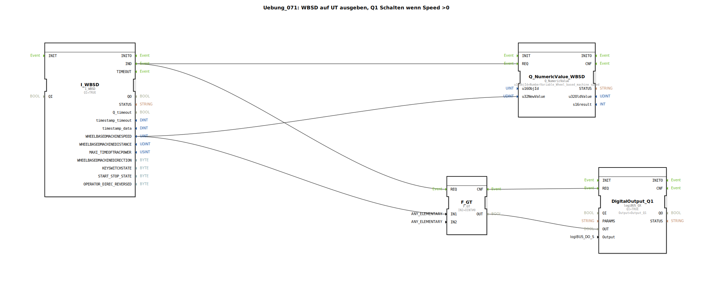

# Uebung_071: WBSD auf UT ausgeben, Q1 Schalten wenn Speed &gt;0

Dieser Artikel beschreibt die logiBUS®-Übung `Uebung_071`. Hier wird die Traktor-Geschwindigkeit nicht nur angezeigt, sondern direkt zur Steuerung eines Aktors verwendet.

----

## Ziel der Übung

Implementierung einer Schwellwert-Logik basierend auf TECU-Daten. Der Ausgang soll automatisch aktiviert werden, sobald sich die Maschine in Bewegung setzt.

-----

## Beschreibung und Komponenten

[cite_start]In `Uebung_071.SUB` wird die radbasierte Geschwindigkeit mit einem festen Wert verglichen[cite: 1].

### Funktionsbausteine (FBs)

  * **`I_WBSD`**: Liefert die aktuelle Geschwindigkeit.
  * **`F_GT`**: Ein Vergleichs-Baustein (Greater Than). [cite_start]Er prüft, ob der Eingangswert größer als 0 ist[cite: 1].
  * **`DigitalOutput_Q1`**: Der Hardware-Ausgang.

-----

## Funktionsweise

Die Logik reagiert auf jede Geschwindigkeits-Nachricht der TECU:
1.  `I_WBSD.IND` triggert den Vergleich `F_GT`.
2.  Ist die Geschwindigkeit > 0, liefert `F_GT.OUT` ein `TRUE`.
3.  Das Bestätigungs-Event `CNF` fordert den Ausgang `Q1` zur Aktualisierung auf.

Ergebnis: Sobald der Traktor anfährt, schaltet der Ausgang `Q1` ein. Bleibt er stehen (Speed = 0), schaltet der Ausgang sofort wieder aus.

-----

## Anwendungsbeispiel

**Automatischer Arbeitsstrahler**:
Eine Rückfahrkamera oder ein Zusatzscheinwerfer soll nur dann aktiv sein, wenn sich die Maschine tatsächlich bewegt. Dies spart Energie und verhindert die Blendung anderer Verkehrsteilnehmer im Stand.