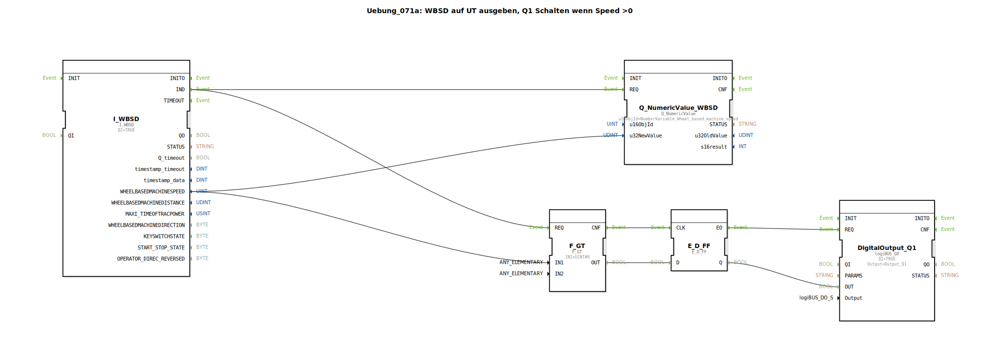

# Uebung_071a: WBSD auf UT ausgeben, Q1 Schalten wenn Speed &gt;0

Dieser Artikel beschreibt die logiBUS®-Übung `Uebung_071a`.

----

## Übersicht

[cite_start]Diese Variante der Übung 071 nutzt ein D-Flip-Flop (`E_D_FF`) zur zeitlichen Synchronisation des Schaltsignals[cite: 1].
Das Ergebnis des Geschwindigkeitsvergleichs wird erst beim Eintreffen des Bestätigungs-Events am Takteingang des Flip-Flops fest übernommen und an den Ausgang `Q1` weitergegeben. Dies sorgt für ein stabileres Schaltverhalten in komplexeren Logik-Netzwerken, indem es sicherstellt, dass Daten und Ereignisse exakt im Gleichtakt verarbeitet werden.

