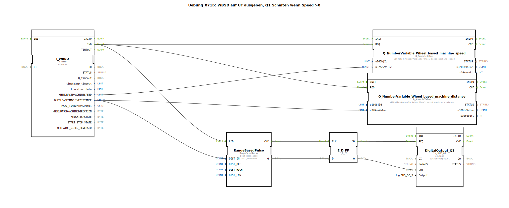

# Uebung_071b: WBSD auf UT ausgeben, Q1 Schalten wenn Speed &gt;0

Dieser Artikel beschreibt die logiBUS®-Übung `Uebung_071b`. Hier steuern wir einen Ausgang nicht über die Geschwindigkeit, sondern über die zurückgelegte Wegstrecke.

----

## Ziel der Übung

Verwendung des Bausteins `RangeBasedPulse`. Es wird gezeigt, wie man ein periodisches Pulssignal erzeugt, das nicht zeitabhängig (alle X Sekunden), sondern wegabhängig (alle X Meter) ist.

-----

## Beschreibung und Komponenten

[cite_start]Die Subapplikation `Uebung_071b.SUB` liest die kumulierte Wegstrecke vom Traktor ein und erzeugt daraus Impulse[cite: 1].

### Funktionsbausteine (FBs)

  * **`I_WBSD`**: Liefert den Wert `WHEELBASEDMACHINEDISTANCE`.
  * **`RangeBasedPulse`**: [cite_start]Dieser Baustein erzeugt einen Pegelwechsel am Ausgang `Q`, sobald eine definierte Distanz (hier 5000 mm = 5 Meter) überschritten wurde[cite: 1].
  * **`E_D_FF`**: Synchronisiert den Puls für den Hardware-Ausgang.

-----

## Funktionsweise

1.  Der Traktor fährt. Der Distanzwert am Baustein `I_WBSD` steigt kontinuierlich an.
2.  Der `RangeBasedPulse` beobachtet diesen Wert.
3.  Alle 5 Meter wechselt der Ausgang des Bausteins seinen Zustand.
4.  Die Lampe an `Q1` blinkt also im Rhythmus des Weges: 5m An, 5m Aus, 5m An...

-----

## Anwendungsbeispiel

**Wegabhängige Dosierung**:
Eine Sämaschine soll alle 10 Meter eine Bodenprobe markieren oder ein Farbsignal abgeben. Durch die Koppelung an den WBSD-Distanzwert erfolgt diese Markierung immer exakt im gleichen Abstand, egal wie schnell oder langsam der Traktor fährt.