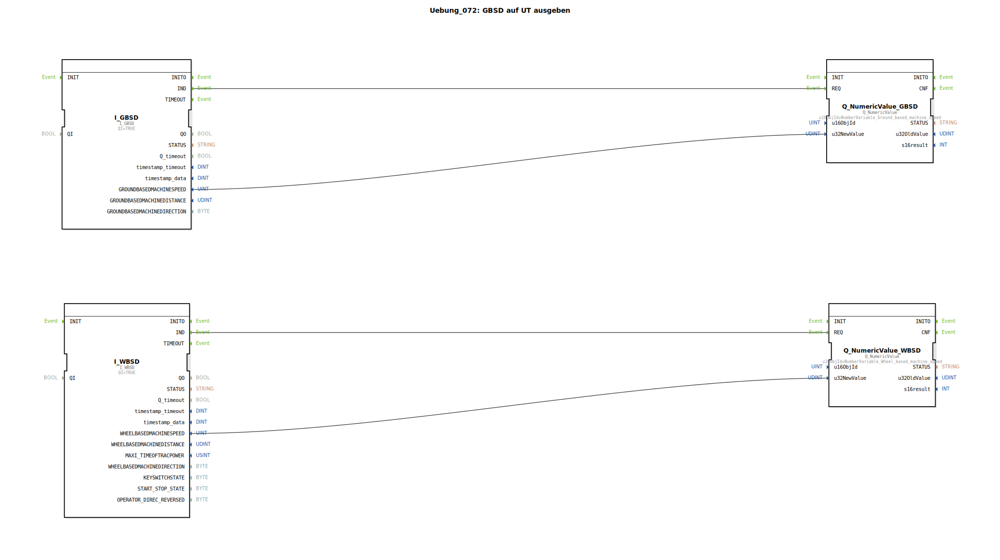

# Uebung_072: GBSD auf UT ausgeben

Dieser Artikel beschreibt die logiBUS®-Übung `Uebung_072`. In der Landtechnik gibt es verschiedene Quellen für die Geschwindigkeit; hier werden die zwei wichtigsten verglichen.

## 🎧 Podcast

* [Eclipse 4diac 3.0: ST-Interpreter, FBE und 7200 Commits – Der Turbo für verteilte Automatisierung](https://podcasters.spotify.com/pod/show/eclipse-4diac-de/episodes/Eclipse-4diac-3-0-ST-Interpreter--FBE-und-7200-Commits--Der-Turbo-fr-verteilte-Automatisierung-e3a5cpl)

----

## Ziel der Übung

Gleichzeitige Verarbeitung von radbasierter (WBSD) und grundbasierter (GBSD) Geschwindigkeit.

-----

## Beschreibung und Komponenten

[cite_start]In `Uebung_072.SUB` werden zwei verschiedene TECU-Eingangsbausteine genutzt und deren Werte auf dem Terminal angezeigt[cite: 1].

### Funktionsbausteine (FBs)

  * **`I_WBSD`**: Radbasierte Geschwindigkeit (Wheel Based). Sie stammt meist vom Getriebe-Sensor.
  * **`I_GBSD`**: Grundbasierte Geschwindigkeit (Ground Based). Sie wird meist über einen Radar-Sensor oder GPS-Empfänger ermittelt.

-----

## Hintergrund: Warum zwei Werte?

Auf losem Untergrund (z.B. nasser Acker) haben die Räder oft Schlupf. Die radbasierte Geschwindigkeit ist dann höher als die tatsächliche Vorwärtsbewegung. Die grundbasierte Geschwindigkeit (Radar) ist in diesem Fall genauer. Durch den Vergleich beider Werte im Programm kann die Steuerung den **Schlupf** berechnen und die Arbeitsprozesse entsprechend anpassen.