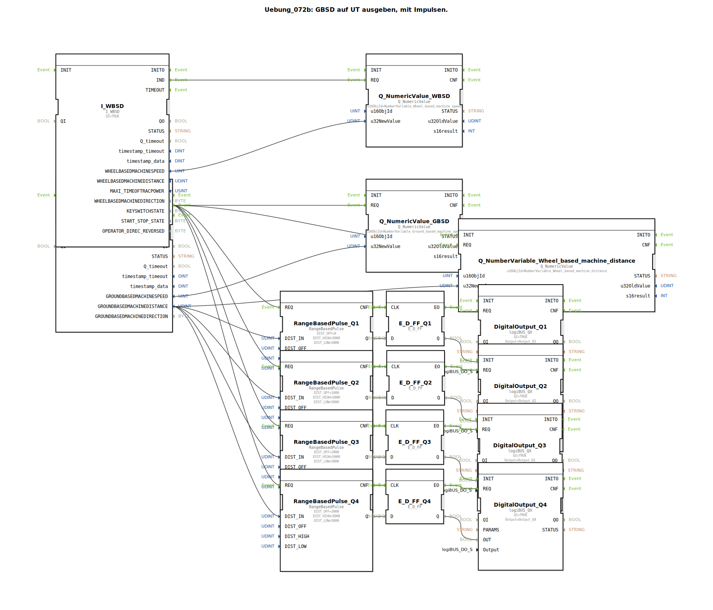

# Uebung_072b: GBSD auf UT ausgeben, mit Impulsen.

Dieser Artikel beschreibt die logiBUS®-Übung `Uebung_072b`. Hier wird eine komplexe wegabhängige Steuerung für mehrere Ausgänge realisiert.

----

## Ziel der Übung

Erzeugung von zeitversetzten Impulsen basierend auf dem GBSD-Distanzwert.

-----

## Beschreibung und Komponenten

[cite_start]In `Uebung_072b.SUB` steuern vier `RangeBasedPulse` Bausteine vier Ausgänge (`Q1` bis `Q4`) an[cite: 1].

### Funktionsweise

Alle Bausteine reagieren auf den gleichen Distanzwert vom Radar (`I_GBSD`). Sie unterscheiden sich jedoch im Parameter **`DIST_OFF`** (Offset):
*   `Q1`: Offset 0 mm.
*   `Q2`: Offset 1000 mm.
*   `Q3`: Offset 2000 mm.
*   `Q4`: Offset 3000 mm.

Dies bewirkt ein "Wander-Muster": Wenn die Maschine fährt, schalten die Ausgänge nacheinander ein und aus, jeweils um einen Meter versetzt zur gefahrenen Strecke.

-----

## Anwendungsbeispiel

**Reihen-Steuerung bei Sämaschinen**:
Die Sähaggregate sind mechanisch versetzt am Rahmen montiert. Um exakt auf einer Linie quer zur Fahrtrichtung mit der Ablage zu beginnen, müssen die Aggregate je nach Fahrgeschwindigkeit und Position zeitversetzt angesteuert werden. Die Offset-Logik sorgt dafür, dass jedes Aggregat genau an der richtigen Stelle im Feld aktiv wird.