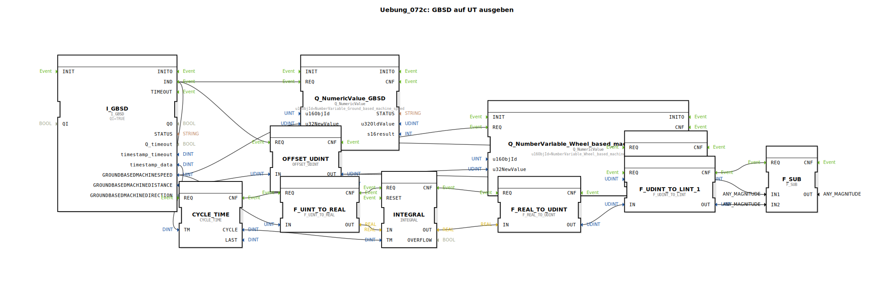

# Uebung_072c: GBSD auf UT ausgeben

Dieser Artikel beschreibt die logiBUS®-Übung `Uebung_072c`. Hier wird eine mathematische Methode gezeigt, um aus der Geschwindigkeit die zurückgelegte Strecke selbst zu berechnen (Integration).

----

## Ziel der Übung

Verwendung des Bausteins `INTEGRAL`. Es wird demonstriert, wie man einen Wegwert manuell berechnet, falls die TECU keinen kumulierten Distanzwert liefert oder dieser für eine Teilmessung (Tageskilometerzähler) genullt werden soll.

-----

## Beschreibung und Komponenten

[cite_start]Die Subapplikation `Uebung_072c.SUB` berechnet den Weg durch zeitliche Integration der radarbasierten Geschwindigkeit[cite: 1].

### Funktionsbausteine (FBs)

  * **`I_GBSD`**: Liefert die aktuelle Geschwindigkeit.
  * **`CYCLE_TIME`**: Misst die Zeit zwischen zwei Geschwindigkeits-Nachrichten (`TM`).
  * **`INTEGRAL`**: Summiert das Produkt aus Geschwindigkeit und Zeit (`v * dt`) auf.
  * **`OFFSET_UDINT`**: Erlaubt das Addieren eines Startwerts oder das Zurücksetzen der Zählung.

-----

## Funktionsweise

Das Programm führt permanent die physikalische Grundformel `Weg = Geschwindigkeit * Zeit` aus. Da die TECU-Daten nie ganz glatt sind, nutzt der `INTEGRAL` Baustein kleine Zeitintervalle (`CYCLE_TIME`), um eine hohe Genauigkeit der aufsummierten Strecke zu erreichen. Das Ergebnis wird am Terminal als `Wheel_based_machine_distance` angezeigt (auch wenn es hier aus Radar-Daten berechnet wurde).