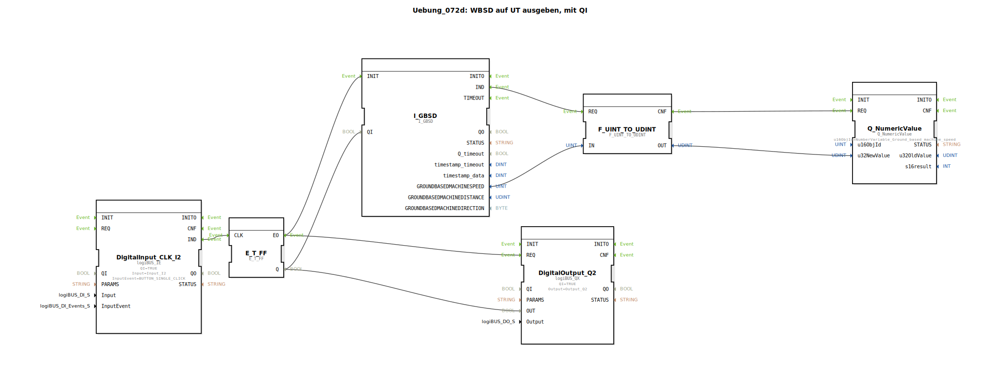

# Uebung_072d: WBSD auf UT ausgeben, mit QI

* * * * * * * * * *  
## Einleitung  
Diese Übung zeigt, wie die arbeitsbreitenbezogene Maschinengeschwindigkeit (WBSD – Working Width Based Ground Speed) auf einem Universal Terminal (UT) ausgegeben werden kann. Die Ausgabe erfolgt gesteuert über einen Qualitätsindikator (QI), der über einen Taster ein- und ausgeschaltet wird. Der QI bestimmt, ob die aktuelle Geschwindigkeit an das UT gesendet wird oder nicht. Der Taster (Digital Input) steuert über einen T-Flipflop sowohl den QI als auch einen digitalen Ausgang (Q2) zur Statusanzeige.

## Verwendete Funktionsbausteine (FBs)  

- **I_GBSD** (Typ: `isobus::tecu::I_GBSD`)  
  - Liest die arbeitsbreitenbezogene Maschinengeschwindigkeit (Ground Based Machine Speed) aus dem CAN‑Bus.  
- **F_UINT_TO_UDINT** (Typ: `iec61131::conversion::F_UINT_TO_UDINT`)  
  - Wandelt den 16‑Bit‑Wert (UINT) der Geschwindigkeit in einen 32‑Bit‑Wert (UDINT) um, wie er vom UT‑Baustein erwartet wird.  
- **Q_NumericValue** (Typ: `isobus::UT::Q::Q_NumericValue`)  
  - Sendet einen numerischen Wert (hier die Geschwindigkeit) an das UT.  
  - Parameter: `u16ObjId` = `NumberVariable_Ground_based_machine_speed` (definiert in der importierten Pool‑Datei).  
- **E_T_FF** (Typ: `iec61499::events::E_T_FF`)  
  - T‑Flipflop: Bei jedem positiven Takt (Ereignis am CLK) wechselt der Ausgang Q seinen Zustand.  
- **DigitalInput_CLK_I2** (Typ: `logiBUS::io::DI::logiBUS_IE`)  
  - Erfasst ein Tasterereignis am Digitaleingang I2 (Konfiguration: `Input_I2`, Ereignis `BUTTON_SINGLE_CLICK`).  
  - Parameter: `QI` = `TRUE`.  
- **DigitalOutput_Q2** (Typ: `logiBUS::io::DQ::logiBUS_QX`)  
  - Steuert den Digitalausgang Q2 zur optischen Rückmeldung des QI‑Zustands.  
  - Parameter: `QI` = `TRUE`, `Output` = `Output_Q2`.

## Programmablauf und Verbindungen  

1. **Eingangssignal**  
   - Ein Tastendruck am Digitaleingang I2 erzeugt ein Ereignis (`BUTTON_SINGLE_CLICK`).  
   - Dieses Ereignis wird über `DigitalInput_CLK_I2.IND` an `E_T_FF.CLK` weitergeleitet.  
   - Der T‑Flipflop `E_T_FF` ändert bei jedem Tastendruck seinen Ausgang `Q`.  

2. **Steuerung des QI und des Digitalausgangs**  
   - Der Zustand `Q` des Flipflops wird zwei Datenverbindungen zugeführt:  
     - An `I_GBSD.QI` (Qualitätsindikator des Geschwindigkeitssensors).  
     - An `DigitalOutput_Q2.OUT` (schaltet den Ausgang Q2 ein/aus).  

3. **Geschwindigkeitserfassung und -umwandlung**  
   - Solange `QI` = `TRUE` ist, sendet `I_GBSD` bei jeder Aktualisierung ein Ereignis `IND` aus.  
   - Dieses Ereignis triggert `F_UINT_TO_UDINT.REQ`, welches die 16‑Bit‑Geschwindigkeit (`I_GBSD.GROUNDBASEDMACHINESPEED`) in einen 32‑Bit‑Wert wandelt.  
   - Der umgewandelte Wert (`F_UINT_TO_UDINT.OUT`) wird an `Q_NumericValue.u32NewValue` übergeben.  

4. **Ausgabe auf das UT**  
   - Nach erfolgreicher Umwandlung erzeugt `F_UINT_TO_UDINT` das Ereignis `CNF`, das `Q_NumericValue.REQ` auslöst.  
   - Der Baustein `Q_NumericValue` sendet den aktuellen Geschwindigkeitswert an das UT unter der Objekt‑ID `NumberVariable_Ground_based_machine_speed`.  

5. **Hinweis**  
   - Die Übung **Uebung_094a** nutzt dasselbe Prinzip.  

## Zusammenfassung  
Die Übung demonstriert die Verknüpfung von ISOBUS‑Elementen (Geschwindigkeitssensor, UT‑Ausgabe) mit Logikbausteinen (T‑Flipflop, Digitalein‑/ausgänge) in 4diac‑IDE. Durch den Taster wird der Qualitätsindikator des Geschwindigkeitssignals gesteuert, sodass die Anzeige am UT nur bei aktiviertem QI aktualisiert wird. Ein digitaler Ausgang gibt den Zustand optisch wieder. Dies ermöglicht eine bedarfsgesteuerte Übertragung von Prozessdaten an das Terminal.