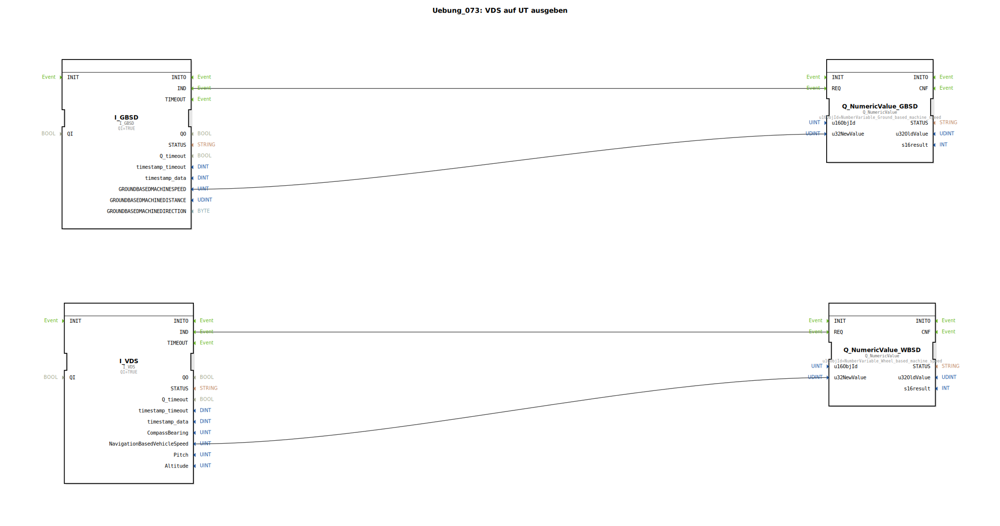

# Uebung_073: VDS auf UT ausgeben

Dieser Artikel beschreibt die logiBUS®-Übung `Uebung_073`. Hier wird die dritte Geschwindigkeitsquelle des ISOBUS erschlossen: Das Navigationssystem.

----

## Ziel der Übung

Verwendung des Bausteins `I_VDS` (Vehicle Direction and Speed).

-----

## Beschreibung und Komponenten

[cite_start]In `Uebung_073.SUB` werden die Radar-Geschwindigkeit (GBSD) und die GPS-Geschwindigkeit (VDS) parallel verarbeitet[cite: 1].

### Funktionsbausteine (FBs)

  * **`I_VDS`**: Dieser Baustein empfängt Daten vom GPS-Empfänger des Traktors (`NavigationBasedVehicleSpeed`).

-----

## Funktionsweise

GPS-Daten sind besonders genau bei konstanter Fahrt auf freiem Feld, können aber bei schneller Beschleunigung oder unter Bäumen/an Gebäuden ungenau werden. In modernen Systemen nutzt man VDS oft als Referenz, um Radar-Sensoren zu kalibrieren oder bei deren Ausfall eine Ausweich-Geschwindigkeit zu haben.