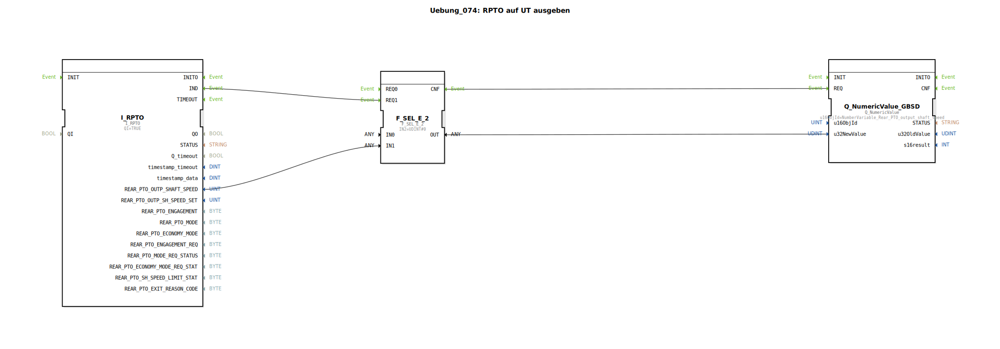

# Uebung_074: RPTO auf UT ausgeben

Dieser Artikel beschreibt die logiBUS®-Übung `Uebung_074`. Hier wird die Drehzahl der Heck-Zapfwelle (Power Take-Off) eingelesen.

## 🎧 Podcast

* [Verpolungsschutz in der Elektronik: Warum die ideale Diode (LM74700) MOSFETs und Schottky-Dioden in Effizienz und Kosten schlägt](https://podcasters.spotify.com/pod/show/ms-muc-lama/episodes/Verpolungsschutz-in-der-Elektronik-Warum-die-ideale-Diode-LM74700-MOSFETs-und-Schottky-Dioden-in-Effizienz-und-Kosten-schlgt-e3a2487)

----

## Ziel der Übung

Verwendung des Bausteins `I_RPTO` (Rear PTO). Es wird gezeigt, wie man mit einer Besonderheit mancher Traktoren umgeht: Wenn die Zapfwelle steht, senden einige TECUs keine "Null", sondern hören einfach auf, Nachrichten zu schicken.

-----

## Beschreibung und Komponenten

[cite_start]In `Uebung_074.SUB` wird ein Sicherheits-Selektor verwendet, um eine saubere Null-Anzeige zu garantieren[cite: 1].

### Funktionsbausteine (FBs)

  * **`I_RPTO`**: Liefert die Drehzahl am Ausgang `REAR_PTO_OUTP_SHAFT_SPEED`.
  * **`F_SEL_E_2`**: Wählt zwischen dem Messwert und einer festen Null aus.

-----

## Funktionsweise ("Fendt-Schaltung")

1.  **Normalbetrieb**: Die TECU sendet Drehzahlen. `I_RPTO.IND` triggert den ersten Eingang des Selektors ➡️ Der Messwert wird zum Terminal durchgereicht.
2.  **Stillstand**: Bleiben die Nachrichten der TECU für längere Zeit aus, feuert der Baustein `I_RPTO.TIMEOUT`.
3.  **Sicherheit**: Dieses Timeout-Event triggert den zweiten Eingang des Selektors. Da hier die Konstante `0` anliegt, springt die Anzeige am Terminal sofort auf "0 U/min" zurück. Dies verhindert, dass der letzte gemessene Wert (z.B. "540") dauerhaft am Display stehen bleibt, obwohl die Welle bereits steht.

-----

## Anwendungsbeispiel

**Gerätesteuerung mit Zapfwellen-Freigabe**:
Ein Gülle-Rührwerk darf nur arbeiten, wenn die Zapfwelle mindestens 300 U/min erreicht hat. Die Logik nutzt den `RPTO`-Wert zur Freigabe. Durch den Timeout-Schutz wird sichergestellt, dass die Freigabe sofort entzogen wird, sobald die Zapfwelle (und damit die TECU-Nachricht) stoppt.