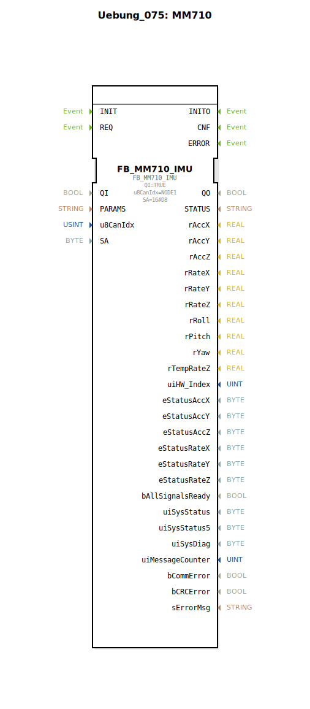

# Uebung_075: MM710

* * * * * * * * * *

## Einleitung

Diese Übung demonstriert die Einbindung des Funktionsbausteins **FB_MM710_IMU** zur Kommunikation mit einem IMU-Sensor vom Typ MM710 über den logiBUS. Der Sensor wird über den CAN-Bus angesteuert und liefert Bewegungsdaten. Die Übung dient als Grundlage für das Verständnis der Parametrierung und Verwendung von CAN-basierten Sensorbausteinen in 4diac.

## Verwendete Funktionsbausteine (FBs)

- **FB_MM710_IMU** (Typ: `logiBUS::bosch::imu::FB_MM710_IMU`)
    - **Parameter**:
        - `QI` = `TRUE` (Aktivierung des Bausteins)
        - `u8CanIdx` = `NODE1` (CAN-Knoten, definiert durch den Import `isobus::pgn::ISO_CAN_NODE::NODE1`)
        - `SA` = `16#D8` (Quelladresse des Sensors im CAN-Netzwerk)
    - **Funktionsweise**: Der FB stellt die Schnittstelle zum IMU-Sensor her. Über den CAN-Bus werden Konfigurations- und Messdaten ausgetauscht. Die Parametrierung erfolgt über die angegebenen Werte. Der Baustein ist für den Einsatz im logiBUS-Ökosystem vorgesehen.

## Programmablauf und Verbindungen

Die SubApp enthält **keine weiteren Funktionsbausteine oder Sub-Bausteine**. Der gesamte Funktionsumfang wird durch den einzelnen FB `FB_MM710_IMU` realisiert. Die SubApp besitzt keine eigenen Ein- oder Ausgänge – sie dient als gekapselte Einheit für die Integration des IMU-Sensors.

**Ablauf**:
1. Nach Aktivierung der SPS wird der FB mit `QI = TRUE` initialisiert.
2. Der Baustein versucht, über den CAN-Bus mit dem Sensor unter der Adresse `0xD8` zu kommunizieren.
3. Nach erfolgreicher Verbindung können Sensordaten (z. B. Beschleunigung, Drehrate) ausgelesen werden (abhängig von der Implementierung des FB).

**Lernziele**:
- Verstehen der Parametrierung eines CAN-basierten IMU-Sensors.
- Kennenlernen des logiBUS-Konzepts und der Verbindung zu 4diac.
- Einblick in die Verwendung von Funktionsbausteinen aus der `logiBUS::bosch::imu`-Bibliothek.

**Voraussetzungen**:
- Grundkenntnisse der 4diac-IDE und des Editors für SubApplikationen.
- Verständnis der CAN-Bus-Kommunikation (ISO 11783, PGN).

## Zusammenfassung

Die Übung **Uebung_075** zeigt die grundlegende Integration des IMU-Sensors MM710 über den logiBUS. Der Funktionsbaustein `FB_MM710_IMU` wird mit den notwendigen Parametern konfiguriert und in einer SubApp gekapselt. Damit wird eine wiederverwendbare Komponente geschaffen, die in größere Automatisierungsprojekte eingebunden werden kann.