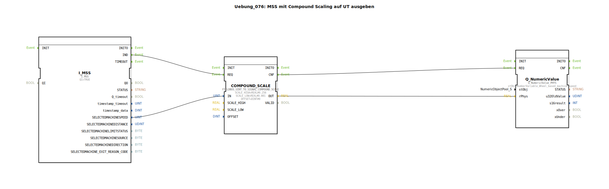

# Uebung_076: MSS mit Compound Scaling auf UT ausgeben

* * * * * * * * * *

## Einleitung

Diese Übung implementiert eine Funktion zur Verarbeitung einer Maschinengeschwindigkeit (Machine Selected Speed – MSS). Der Wert wird über einen Compound-Scale-Funktionsbaustein skaliert und anschließend auf ein Universal Terminal (UT) als numerischer Wert ausgegeben. Die Skalierung erfolgt mit einem oberen und unteren Faktor (0,256 und 0,001). Ein TODO-Hinweis weist darauf hin, dass der verwendete Objekt-Pool-Eintrag (NumberVariable_Wheel_based_machine_speed) vorerst als Platzhalter dient und später durch den korrekten Eintrag (NumberVariable_Machine_selected_speed) ersetzt werden sollte.

## Verwendete Funktionsbausteine (FBs)

### Sub-Bausteine: `I_MSS`

- **Typ**: `isobus::tecu::I_MSS`
- **Parameter**:
  - `QI` = `TRUE`
- **Funktionsweise**:  
  Dieser FB stellt den Eingang für die Maschinengeschwindigkeit dar. Er liefert bei einer Eingabe an seinem Ereigniseingang `QI` den aktuellen Maschinengeschwindigkeitswert (Typ: vermutlich UINT) am Datenausgang `SELECTEDMACHINESPEED`. Der Ereignisausgang `IND` signalisiert, dass ein neuer Wert vorliegt.

### Sub-Bausteine: `COMPOUND_SCALE`

- **Typ**: `logiBUS::signalprocessing::fieldbus::FIELDBUS_UINT_TO_SIGNAL_COMPOUND_SCALE`
- **Parameter**:
  - `SCALE_HIGH` = `REAL#0.256`
  - `SCALE_LOW` = `REAL#0.001`
  - `OFFSET` = `DINT#0`
- **Funktionsweise**:  
  Dieser FB führt eine zusammengesetzte Skalierung (Compound Scaling) eines vorzeichenlosen Integer-Wertes (UINT) durch. Der eingehende Wert `IN` wird mit zwei verschiedenen Skalierungsfaktoren multipliziert, um eine höhere Genauigkeit im unteren und oberen Wertebereich zu erreichen. Der Ausgang `OUT` liefert den skalierten Wert (Typ: REAL). Der Ereigniseingang `REQ` startet die Berechnung; bei Abschluss wird am Ereignisausgang `CNF` ein Signal ausgegeben.

### Sub-Bausteine: `Q_NumericValue`

- **Typ**: `isobus::UT::Q::Q_NumericValue_PHYS`
- **Parameter**:
  - `stObj` = `NumberVariable_Wheel_based_machine_speed`
- **Funktionsweise**:  
  Dieser FB dient der Ausgabe eines numerischen Werts auf das Universal Terminal. Der übergebene physikalische Wert (Eingang `rPhys`, Typ: REAL) wird entsprechend der Eigenschaften des referenzierten Objekt-Pool-Eintrags (`stObj`) an das UT gesendet. Der Ereigniseingang `REQ` löst die Ausgabe aus.

## Programmablauf und Verbindungen

Der Ablauf erfolgt rein intern innerhalb des Subapplikationstyps (keine äußeren Schnittstellen). Die Verbindungen zwischen den Funktionsbausteinen sind wie folgt:

**Ereignisverbindungen**:
1. `I_MSS.IND` → `COMPOUND_SCALE.REQ`  
   Sobald ein neuer MSS-Wert anliegt, wird die Skalierung angestoßen.
2. `COMPOUND_SCALE.CNF` → `Q_NumericValue.REQ`  
   Nach abgeschlossener Skalierung wird der ausgegebene Wert zum UT gesendet.

**Datenverbindungen**:
1. `I_MSS.SELECTEDMACHINESPEED` → `COMPOUND_SCALE.IN`  
   Der rohe Maschinengeschwindigkeitswert (UINT) wird an den Skalierungsbaustein weitergeleitet.
2. `COMPOUND_SCALE.OUT` → `Q_NumericValue.rPhys`  
   Der skalierte Wert (REAL) wird als physikalischer Wert für die UT-Ausgabe übergeben.

Ein Kommentar im Netzwerk enthält den Hinweis, dass der verwendete Objekt-Pool-Eintrag `NumberVariable_Wheel_based_machine_speed` nur als Platzhalter dient. In einer finalen Implementierung sollte dieser durch `NumberVariable_Machine_selected_speed` ersetzt werden.

## Zusammenfassung

Die Übung `Uebung_076` demonstriert die Verarbeitung einer Maschinengeschwindigkeit mittels Compound Scaling und die anschließende Ausgabe auf ein Universal Terminal. Der Datenfluss ist linear: Der Eingangswert wird skaliert und dann als physikalische Größe an das UT übergeben. Die Skalierungsparameter sind fest vorgegeben (0,256 für den oberen, 0,001 für den unteren Bereich). Die Übung zeigt die Verwendung von ISOBUS-spezifischen Funktionsbausteinen (I_MSS, Q_NumericValue) sowie eines generischen Feldbus-Skalierungsbausteins. Der TODO-Kommentar weist auf eine notwendige Anpassung des Objekt-Pool-Eintrags hin.