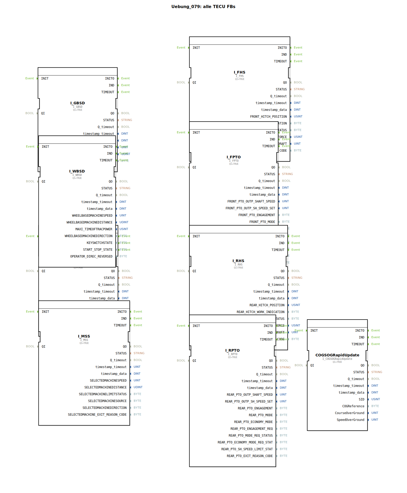

# Uebung_079: alle TECU FBs

Dieser Artikel beschreibt die logiBUS®-Übung `Uebung_079`. Dies ist eine Sammel-Übung, die alle verfügbaren Bausteine zur Erfassung von Traktor-Informationen vorstellt.

----

## Ziel der Übung

Erlernen der gesamten Palette an TECU-Schnittstellenbausteinen. Ein ISOBUS-Traktor meldet eine Vielzahl von physikalischen Werten über den CAN-Bus, die in 4diac direkt als Bausteine genutzt werden können.

-----

## Übersicht der Bausteine (FBs)

[cite_start]In `Uebung_079.SUB` sind alle relevanten TECU-Eingangsbausteine platziert[cite: 1]:

1.  **`I_GBSD`**: Ground Based Speed & Distance (Radar/GPS-Weg).
2.  **`I_WBSD`**: Wheel Based Speed & Distance (Getriebe-Weg).
3.  **`I_VDS`**: Vehicle Direction and Speed (Navigationsdaten).
4.  **`I_RPTO` & `I_FPTO`**: Heck- und Front-Zapfwellendrehzahl (Rear/Front Power Take-Off).
5.  **`I_RHS` & `I_FHS`**: Heck- und Front-Hubwerksposition (Rear/Front Hitch Status).
6.  **`I_MSS`**: Machine Specific Status.
7.  **`COGSOGRapidUpdate`**: Hochfrequente Kurs- und Geschwindigkeitsdaten über Grund.

-----

## Anwendung in der Praxis

Jeder dieser Bausteine lauscht auf die standardisierten ISOBUS-Nachrichten der jeweiligen Traktor-ECU. Das logiBUS-System sorgt dafür, dass diese komplexen Protokoll-Daten in einfache IEC 61499 Ereignisse und Datenwerte gewandelt werden. Der Entwickler muss sich nicht um CAN-IDs oder Bit-Masken kümmern, sondern kann direkt mit den physikalischen Größen wie "Drehzahl" oder "Position" arbeiten.