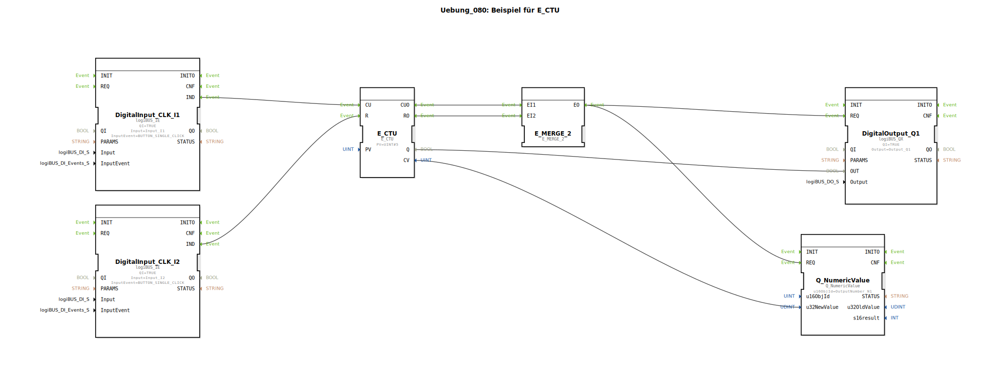

# Uebung_080: Beispiel für E_CTU

Dieser Artikel beschreibt die logiBUS®-Übung `Uebung_080`. Hier wird das grundlegende Prinzip des Zählens von Ereignissen vorgestellt.

## 🎧 Podcast

* [800 PS Hightech-Riese: Was die Betriebsanleitung des ROPA Tiger 6S über moderne Landwirtschaft und extreme Sicherheit verrät](https://podcasters.spotify.com/pod/show/ms-muc-lama/episodes/800-PS-Hightech-Riese-Was-die-Betriebsanleitung-des-ROPA-Tiger-6S-ber-moderne-Landwirtschaft-und-extreme-Sicherheit-verrt-e3aub4t)

----

## Ziel der Übung

Verwendung des Bausteins `E_CTU` (Event Count Up). Es wird gezeigt, wie man eine bestimmte Anzahl von Ereignissen (z.B. Tastendrücke) erfasst und beim Erreichen eines Grenzwerts eine Aktion auslöst.

-----

## Beschreibung und Komponenten

[cite_start]Die Subapplikation `Uebung_080.SUB` nutzt einen Zählerbaustein mit Set- und Reset-Logik[cite: 1].

### Funktionsbausteine (FBs)

  * **`DigitalInput_I1` (Count)**: Jeder Klick erhöht den Zähler.
  * **`DigitalInput_I2` (Reset)**: Setzt den Zählerstand auf Null zurück.
  * **`E_CTU`**: Der Zähler-Baustein. [cite_start]Der Parameter `PV` (Preset Value) ist auf 5 eingestellt[cite: 1].
  * **`DigitalOutput_Q1`**: Zeigt den Status des Zählers an.

-----

## Funktionsweise

1.  Der Nutzer klickt auf **I1**. Der Zählerstand (`CV`) erhöht sich bei jedem Event.
2.  Der Ausgang `Q` des Zählers wechselt auf `TRUE`, sobald der Zählerstand den Wert 5 erreicht oder überschreitet (`CV >= PV`).
3.  Die Lampe an **Q1** leuchtet auf.
4.  Durch Klick auf **I2** wird der Zähler gelöscht, `Q` wird wieder `FALSE` und die Lampe geht aus.

-----

## Anwendungsbeispiel

**Stückzähler**:
An einer Verpackungsmaschine werden die Kartons gezählt. Sobald 5 Kartons auf der Palette sind, wird ein Signal (`Q1`) gegeben, um die Palette automatisch auszufahren. Der Fahrer drückt nach dem Holen einer neuen Palette "Reset" (`I2`), um den nächsten Vorgang zu starten.