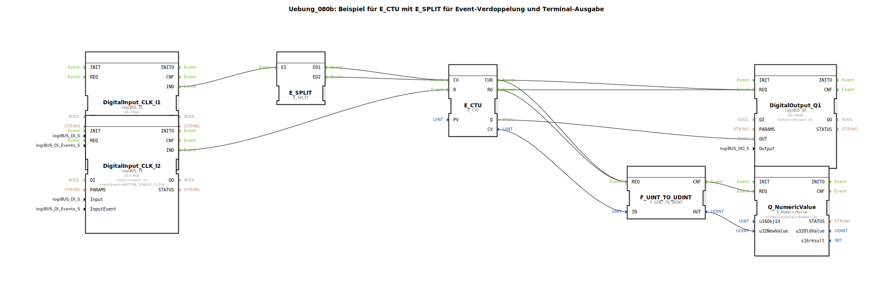

# Uebung_080b: Beispiel für E_CTU mit E_SPLIT für Event-Verdoppelung und Terminal-Ausgabe

Dieser Artikel beschreibt die logiBUS®-Übung `Uebung_080b`. Hier wird gezeigt, wie man die Anzahl der eintreffenden Ereignisse künstlich verdoppelt.

----

## Ziel der Übung

Manipulation von Ereignisströmen unter Verwendung von `E_SPLIT`.

-----

## Funktionsweise

[cite_start]In `Uebung_080b.SUB` wird ein Ereignis-Splitter vor den Zähler geschaltet[cite: 1].

Jeder einzelne Klick auf Taster **I1** erreicht den Eingang `E_SPLIT.EI`. Der Splitter feuert daraufhin **zwei** Ereignisse (`EO1` und `EO2`) nacheinander ab. Da beide Ausgänge wieder auf den `CU`-Eingang des Zählers gemerged (zusammengeführt) werden, erhält der Zähler pro Tastendruck zwei Impulse.

**Ergebnis**: Die Lampe `Q1` (Schwelle 5) leuchtet bereits nach dem 3. Tastendruck auf (Zählerstand ist dann bereits auf 6 gesprungen).

-----

## Anwendungsbeispiel

Anpassung von Sensor-Impulsen: Ein Getriebesensor liefert einen Impuls pro Radumdrehung, die Logik benötigt aber zwei Impulse pro Umdrehung zur genaueren Berechnung. Der Splitter verdoppelt die eintreffende Frequenz rein softwareseitig.