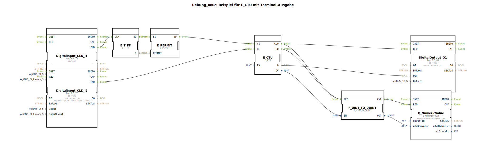

# Uebung_080c: Beispiel für E_CTU mit Terminal-Ausgabe

Dieser Artikel beschreibt die logiBUS®-Übung `Uebung_080c`. Hier wird das Gegenteil der vorherigen Übung gezeigt: Die Reduzierung der Ereignisanzahl um die Hälfte.

----

## Ziel der Übung

Manipulation von Ereignisströmen unter Verwendung von `E_T_FF` und `E_PERMIT`.

-----

## Funktionsweise

[cite_start]In `Uebung_080c.SUB` wird ein Toggle-Flip-Flop als Gate-Wächter genutzt[cite: 1].

1.  Jeder Klick auf **I1** toggelt das Flip-Flop. Der Zustand wechselt also: TRUE, FALSE, TRUE, FALSE...
2.  Das `E_PERMIT` lässt Ereignisse nur durch, wenn der `PERMIT` Eingang auf TRUE steht.
3.  Daher wird nur bei jedem zweiten Klick (wenn das Flip-Flop gerade auf TRUE steht) ein Ereignis an den Zähler weitergereicht.

**Ergebnis**: Um die Lampe `Q1` (Schwelle 5) zum Leuchten zu bringen, muss der Nutzer nun 10 mal auf den Taster klicken.

-----

## Anwendungsbeispiel

Unterdrückung von Prell-Effekten oder grobe Skalierung von schnellen Sensorsignalen, um die Rechenlast der nachfolgenden Logik zu verringern.