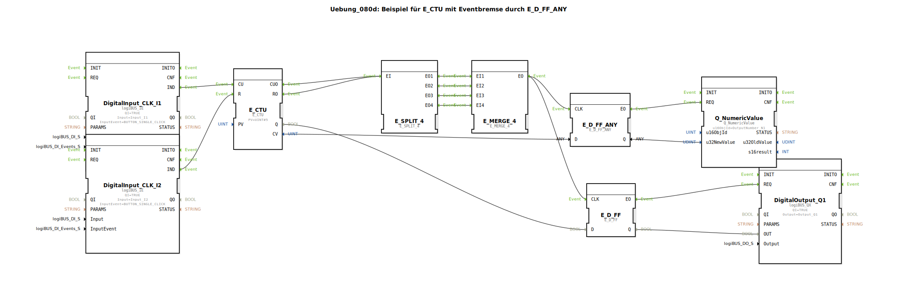

# Uebung_080d: Beispiel für E_CTU mit Eventbremse durch E_D_FF_ANY

* * * * * * * * * *

## Einleitung

Diese Übung demonstriert den Einsatz eines Aufwärtszählers (`E_CTU`) in Kombination mit einer **Event‑Bremse**, realisiert durch die beiden Flip‑Flops `E_D_FF_ANY` und `E_D_FF`.  
Der Zählerstand und das boolesche Ausgangssignal (Überlauf bzw. Erreichen des Grenzwerts) werden **nur dann** an die Ausgänge weitergegeben, wenn ein Ereignis des Zählers (Zählimpuls oder Reset) ausgelöst wird. Dadurch wird vermieden, dass die Ausgänge bei jedem Systemtakt unnötig aktualisiert werden.

## Verwendete Funktionsbausteine (FBs)

Im Subapplikationsnetzwerk sind folgende Bausteine enthalten:

- **DigitalOutput_Q1** (Typ: `logiBUS_QX`)  
  - Parameter: `QI = TRUE`, `Output = Output_Q1`

- **DigitalInput_CLK_I1** (Typ: `logiBUS_IE`)  
  - Parameter: `QI = TRUE`, `Input = Input_I1`, `InputEvent = BUTTON_SINGLE_CLICK`

- **DigitalInput_CLK_I2** (Typ: `logiBUS_IE`)  
  - Parameter: `QI = TRUE`, `Input = Input_I2`, `InputEvent = BUTTON_SINGLE_CLICK`

- **E_CTU** (Typ: `E_CTU`)  
  - Parameter: `PV = UINT#5`

- **E_SPLIT_4** (Typ: `E_SPLIT_4`)  
  - Keine Parameter

- **E_MERGE_4** (Typ: `E_MERGE_4`)  
  - Keine Parameter

- **E_D_FF_ANY** (Typ: `E_D_FF_ANY`)  
  - Keine Parameter

- **E_D_FF** (Typ: `E_D_FF`)  
  - Keine Parameter

- **Q_NumericValue** (Typ: `Q_NumericValue`)  
  - Parameter: `u16ObjId = OutputNumber_N1`

## Programmablauf und Verbindungen

1. **Eingänge**  
   - Taster **I1** (Single‑Click) ist mit `DigitalInput_CLK_I1` verbunden und erzeugt ein Ereignis am Ausgang `IND`.  
   - Taster **I2** (Single‑Click) ist mit `DigitalInput_CLK_I2` verbunden und erzeugt ebenfalls ein Ereignis an `IND`.

2. **Zähler E_CTU**  
   - Der Ereignisausgang von `DigitalInput_CLK_I1` wird auf den Eingang `CU` (Count Up) des Zählers geführt.  
   - Der Ereignisausgang von `DigitalInput_CLK_I2` wird auf den Eingang `R` (Reset) des Zählers geführt.  
   - Der Zähler zählt bei jedem Impuls auf I1 den aktuellen Wert hoch. Bei Erreichen des Grenzwerts `PV = 5` wird der Ausgang `Q = TRUE`. Ein Reset setzt den Zählerstand auf 0 und `Q` auf FALSE.  
   - Die Ereignisausgänge `CUO` (nach erfolgreichem Zählen) und `RO` (nach Reset) werden jeweils ausgelöst.

3. **Event‑Bremsen‑Logik**  
   - Beide Ereignisse (`CUO` und `RO`) werden über den Baustein **E_SPLIT_4** auf vier Ausgänge verteilt.  
   - Die vier Ausgänge werden im **E_MERGE_4** wieder zu einem gemeinsamen Ereignis zusammengeführt. Jeder eingehende Impuls erzeugt so ein einziges Ereignis am Ausgang `EO`.  
   - Dieses zusammengeführte Ereignis dient als Takt (`CLK`) für die beiden Flip‑Flops:  
     - **E_D_FF_ANY** speichert den aktuellen Zählerstand (`CV`) und gibt ihn bei jedem Takt aus.  
     - **E_D_FF** speichert den booleschen Ausgang (`Q`) des Zählers und gibt ihn ebenfalls bei jedem Takt aus.

4. **Ausgänge**  
   - Der gespeicherte Zählerwert von `E_D_FF_ANY` wird über den Baustein **Q_NumericValue** als numerischer Wert auf der Anzeige `OutputNumber_N1` ausgegeben.  
   - Der gespeicherte boolesche Wert von `E_D_FF` wird über **DigitalOutput_Q1** auf den digitalen Ausgang `Output_Q1` geschaltet.

Durch diese Verkettung wird sichergestellt, dass die Ausgänge nur dann aktualisiert werden, wenn der Zähler tatsächlich einen Schritt ausführt (Count oder Reset) – nicht bei jedem Systemtakt. Dies entspricht einer **Event‑gesteuerten Bremse**.

## Zusammenfassung

Die Übung veranschaulicht die Kopplung von Ereignis‑ und Datenflüssen in einer 4diac‑IDE Subapplikation.  
Der Aufwärtszähler wird durch zwei Taster gesteuert. Seine aktuellen Werte (Zählerstand und Überlaufsignal) werden über eine Kombination aus Ereignis‑Splitter und ‑Merger auf Flip‑Flops gegeben, die als Speicher dienen. Die Flip‑Flops geben die gespeicherten Daten nur dann weiter, wenn ein Zähl‑ oder Reset‑Ereignis vorliegt. Dies verhindert unnötige Aktualisierungen und zeigt, wie mit einfachen Mitteln eine **Event‑Bremse** realisiert werden kann.