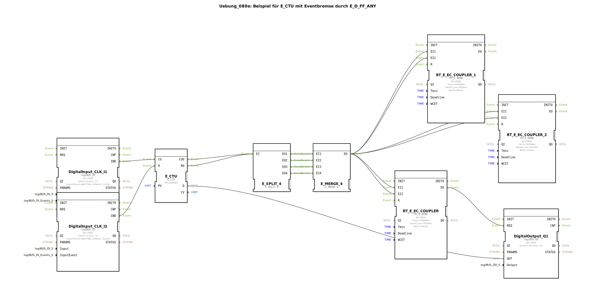

# Uebung_080e: Beispiel für E_CTU mit Eventbremse durch E_D_FF_ANY

* * * * * * * * * *

## Einleitung

Diese Übung demonstriert den Einsatz eines Aufwärtszählers (`E_CTU`) in Verbindung mit einer Ereignisbremse, realisiert durch `RT_E_REND`-Bausteine. Der Zähler wird über zwei Taster (Tipptaster mit Einfachklick) gesteuert: ein Taster zum Zählen (CU), ein weiterer zum Rücksetzen (R). Das Zählergebnis wird auf einen digitalen Ausgang gegeben. Die Ereignisbremse sorgt für eine zeitliche Entprellung und Entkopplung der Ereignisse. Es werden keine Sub-App-Bausteine verwendet; alle Funktionsbausteine sind Standard- oder gerätespezifische Bibliothekselemente.

## Verwendete Funktionsbausteine (FBs)

- **DigitalInput_CLK_I1**  
  - **Typ**: `logiBUS::io::DI::logiBUS_IE`  
  - **Parameter**:  
    - `QI` = `TRUE`  
    - `Input` = `Input_I1`  
    - `InputEvent` = `BUTTON_SINGLE_CLICK`  
  - **Funktion**: Erzeugt bei Tastendruck (Einfachklick) ein Ereignis am Ausgang `IND`. Dient als Zähltakt für den Aufwärtszähler.

- **DigitalInput_CLK_I2**  
  - **Typ**: `logiBUS::io::DI::logiBUS_IE`  
  - **Parameter**:  
    - `QI` = `TRUE`  
    - `Input` = `Input_I2`  
    - `InputEvent` = `BUTTON_SINGLE_CLICK`  
  - **Funktion**: Erzeugt bei Tastendruck ein Ereignis am Ausgang `IND`. Dient als Rücksetzsignal für den Zähler.

- **E_CTU** (Aufwärtszähler)  
  - **Typ**: `iec61499::events::E_CTU`  
  - **Parameter**:  
    - `PV` = `UINT#5`  
  - **Ereigniseingänge/-ausgänge**:  
    - `CU` (zählen)  
    - `R` (rücksetzen)  
    - `CUO` (Ausgang nach Zählereignis)  
    - `RO` (Ausgang nach Rücksetzen)  
  - **Datenausgang**:  
    - `Q` (aktueller Zählerstand, als `UINT`)  
  - **Funktion**: Zählt bei jedem Ereignis an `CU` hoch (beginnend bei 0), bis der Wert `PV` (hier 5) erreicht ist; dann wird `Q` gesetzt. Bei Ereignis an `R` wird der Zähler zurückgesetzt.

- **E_SPLIT_4**  
  - **Typ**: `iec61499::events::E_SPLIT_4`  
  - **Funktion**: Verteilt ein eingehendes Ereignis (an `EI`) auf bis zu vier Ausgänge (`EO1`–`EO4`). Genutzt zur parallelen Verarbeitung nach Zählerereignissen.

- **E_MERGE_4**  
  - **Typ**: `iec61499::events::E_MERGE_4`  
  - **Funktion**: Führt bis zu vier eingehende Ereignisse (an `EI1`–`EI4`) zu einem gemeinsamen Ausgang (`EO`) zusammen. Fasst die parallelen Zweige wieder zu einem Ereignisstrom zusammen.

- **RT_E_EC_COUPLER** (drei Exemplare)  
  - **Typ**: `eclipse4diac::rtevents::RT_E_REND`  
  - **Parameter** (für alle drei):  
    - `QI` = `TRUE`  
    - `Tmin` = `T#500ms`  
    - `Deadline` = `T#20ms`  
    - `WCET` = `T#1ms`  
  - **Ereigniseingänge**: `EI1`, `EI2`  
  - **Ereignisausgang**: `EO`  
  - **Funktion**: Stellt eine zeitliche Entkopplung und Mindestabstand von 500 ms zwischen Ereignissen sicher. Dient als „Ereignisbremse“, um schnelle Tippfolgen zu glätten.

- **DigitalOutput_Q1**  
  - **Typ**: `logiBUS::io::DQ::logiBUS_QX`  
  - **Parameter**:  
    - `QI` = `TRUE`  
    - `Output` = `Output_Q1`  
  - **Ereigniseingang**: `REQ`  
  - **Dateneingang**: `OUT` (vom Zählerstand `Q` des `E_CTU`)  
  - **Funktion**: Schaltet den digitalen Ausgang Q1 auf den Wert, der am Dateneingang anliegt, sobald ein Ereignis an `REQ` eintrifft.

## Programmablauf und Verbindungen

1. **Eingangsereignisse**:  
   - Taster an `Input_I1` (Einfachklick) erzeugt ein Ereignis an `DigitalInput_CLK_I1.IND`.  
   - Taster an `Input_I2` (Einfachklick) erzeugt ein Ereignis an `DigitalInput_CLK_I2.IND`.  

2. **Zählersteuerung**:  
   - Das Ereignis von `DigitalInput_CLK_I1.IND` wird mit dem Eingang `E_CTU.CU` verbunden – zählt hoch.  
   - Das Ereignis von `DigitalInput_CLK_I2.IND` wird mit dem Eingang `E_CTU.R` verbunden – setzt zurück.  

3. **Ereignisverteilung und -zusammenführung**:  
   - Die Ausgänge `E_CTU.CUO` und `E_CTU.RO` werden auf den gemeinsamen Eingang `E_SPLIT_4.EI` geschaltet (beide Ereignisse lösen denselben Split aus).  
   - Die vier Ausgänge `EO1`–`EO4` werden auf die vier Eingänge `EI1`–`EI4` des `E_MERGE_4` gelegt. Dadurch wird jedes Zähler- oder Rücksetzereignis vierfach durchgeschleift (hier redundant, um alle Ausgänge zu bedienen).  
   - Der Merge-Ausgang `EO` führt diese zu einem einzigen Ereignisstrom zusammen.  

4. **Ereignisbremse (RT_E_REND)**:  
   - Das zusammengeführte Ereignis wird auf die Eingänge `EI1` und `EI2` aller drei `RT_E_REND`-Bausteine gelegt.  
   - Der Ausgang `EO` des ersten `RT_E_REND` löst den `REQ`-Eingang des Digitalausgabebausteins `DigitalOutput_Q1` aus.  
   - Die anderen beiden `RT_E_REND` sind ebenfalls im Netzwerk vorhanden (ggf. vorbereitet für weitere Ausgänge oder Redundanz), werden aber im aktuellen Datenfluss nicht direkt mit einem nachfolgenden FB verbunden.  

5. **Datenfluss**:  
   - Der aktuelle Zählerstand `E_CTU.Q` ist direkt mit dem Dateneingang `DigitalOutput_Q1.OUT` verbunden. Bei jedem Ereignis an `REQ` wird dieser Wert auf den physischen Ausgang `Output_Q1` übernommen.  

**Lernziele dieser Übung**:  
- Verständnis des Aufwärtszählers `E_CTU` in IEC 61499.  
- Einsatz von Ereignis-Split und -Merge zur Parallelverarbeitung.  
- Nutzung von `RT_E_REND` als zeitliche Entprellung (Ereignisbremse) zur Stabilisierung der Signalverarbeitung.  

**Schwierigkeitsgrad**: Fortgeschritten (Ereignissteuerung mit mehreren Bausteinen).  
**Erforderliche Vorkenntnisse**: Grundlagen der 4diac-IDE, Aufbau einfacher Steuerungen mit digitalen Ein-/Ausgängen.  
**Start der Übung**: SubApp in ein leeres Projekt einfügen, die Taster und den Ausgang entsprechend der Hardware (z. B. logiBUS) verschalten.  

## Zusammenfassung

Die Übung zeigt eine typische Zähleranwendung mit zwei Tastern, bei der ein Aufwärtszähler durch Tipptaster erhöht und zurückgesetzt wird. Der Zählerstand wird auf einen digitalen Ausgang gegeben. Durch die Verwendung von `E_SPLIT_4`, `E_MERGE_4` und vor allem der `RT_E_REND`-Bausteine wird das Ereignisverarbeitung robust gegenüber schnellen Tippfolgen gemacht – die Ereignisbremse erzwingt eine Mindestzeit von 500 ms zwischen zwei Verarbeitungsschritten. Dies verhindert ungewollte Mehrfachausgaben und entkoppelt die Eingabe von der Ausgabe.