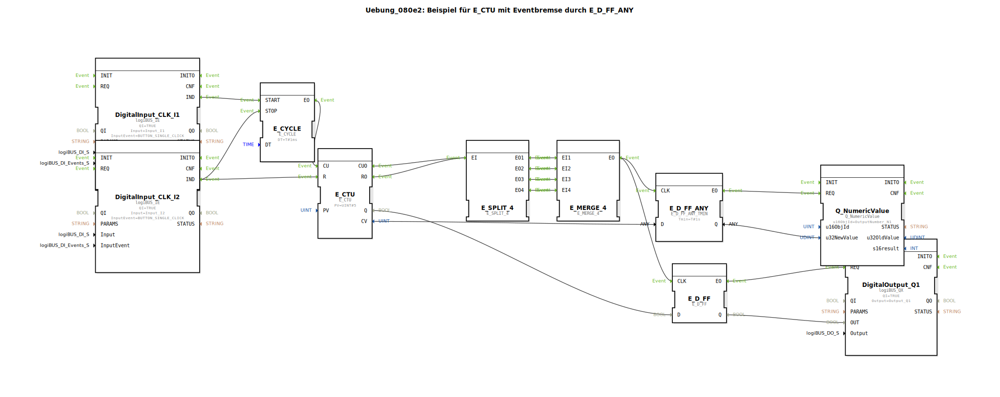

# Uebung_080e2: Beispiel für E_CTU mit Eventbremse durch E_D_FF_ANY

* * * * * * * * * *

## Einleitung

Diese Übung demonstriert die Verwendung eines Aufwärtszählers (E_CTU) in Kombination mit einer **Eventbremse**, realisiert durch den Baustein `E_D_FF_ANY_TMIN`. Der Zähler wird über einen zyklischen Ereignisgeber (E_CYCLE) inkrementiert, sobald ein Tastendruck an `DigitalInput_CLK_I1` erfolgt. Durch einen zweiten Tastendruck an `DigitalInput_CLK_I2` wird der Zähler zurückgesetzt und der Zyklus gestoppt. Die ausgegebenen Zählwerte werden nur dann an einen numerischen Ausgang weitergegeben, wenn die minimale Verweildauer (`Tmin`) des Signalzustands überschritten wird – dies verhindert ungewollte oder rauschende Werte. Ein zusätzlicher D-Flipflop-Baustein (`E_D_FF`) gibt den Zählerstatus (Q) als binäres Signal auf einen Digitalausgang.

## Verwendete Funktionsbausteine (FBs)

Die Übung verwendet die folgenden vordefinierten Funktionsbausteine im Netzwerk:

| Bausteinname | Typ | Parameter | Kurzbeschreibung |
|--------------|-----|-----------|------------------|
| `DigitalInput_CLK_I1` | `logiBUS::io::DI::logiBUS_IE` | `QI = TRUE`, `Input = Input_I1`, `InputEvent = BUTTON_SINGLE_CLICK` | Erzeugt ein Ereignis (`IND`) bei einfachem Tastendruck auf Eingang I1. |
| `DigitalInput_CLK_I2` | `logiBUS::io::DI::logiBUS_IE` | `QI = TRUE`, `Input = Input_I2`, `InputEvent = BUTTON_SINGLE_CLICK` | Erzeugt ein Ereignis (`IND`) bei einfachem Tastendruck auf Eingang I2. |
| `E_CYCLE` | `iec61499::events::E_CYCLE` | `DT = T#1ms` | Zyklischer Ereignisgenerator; erzeugt nach Start alle 1 ms ein Ereignis (`EO`) bis zum Stopp. |
| `E_CTU` | `iec61499::events::E_CTU` | `PV = UINT#5` | Aufwärtszähler: zählt bei jedem Ereignis an `CU` hoch; gibt den aktuellen Zählwert (`CV`) und ein Überlaufsignal (`Q`) aus. Reset über `R`. |
| `E_SPLIT_4` | `iec61499::events::E_SPLIT_4` | – | Verteilt ein eingehendes Ereignis auf vier parallele Ausgänge (`EO1` … `EO4`). |
| `E_MERGE_4` | `iec61499::events::E_MERGE_4` | – | Fasst bis zu vier Eingangsereignisse (`EI1` … `EI4`) zu einem einzigen Ausgangsereignis (`EO`) zusammen. |
| `E_D_FF_ANY` | `iec61499::events::E_D_FF_ANY_TMIN` | `Tmin = T#1s` | D-Flipflop mit Mindestverweildauer: Übernimmt den Dateneingang `D` bei einem Ereignis an `CLK`, gibt den Zustand an `Q` aus, aber nur wenn das Ereignis mindestens `Tmin` lang anliegt. |
| `E_D_FF` | `iec61499::events::E_D_FF` | – | Standard-D-Flipflop: Übernimmt den Dateneingang `D` bei einem Ereignis an `CLK` und gibt den Zustand an `Q` aus. |
| `DigitalOutput_Q1` | `logiBUS::io::DQ::logiBUS_QX` | `QI = TRUE`, `Output = Output_Q1` | Setzt den Digitalausgang Q1 auf den Wert des Eingangs `OUT`. |
| `Q_NumericValue` | `isobus::UT::Q::Q_NumericValue` | `u16ObjId = OutputNumber_N1` | Gibt einen numerischen Wert (32-Bit Integer) auf einer Visualisierungskomponente aus (hier: `OutputNumber_N1`). |

## Programmablauf und Verbindungen

### Ereignisverbindungen

1. **Start des Zyklus**: Ein Tastendruck an `DigitalInput_CLK_I1` löst das Ereignis `IND` aus. Dieses startet den `E_CYCLE` (über `START`).
2. **Zähler-Takt**: Der `E_CYCLE` erzeugt alle 1 ms ein Ereignis (`EO`), welches direkt an den Zähleingang `CU` des `E_CTU` geht.
3. **Zähler-Auswertung**: Der `E_CTU` gibt bei jedem Inkrement (oder Überlauf) ein Ereignis an `CUO` bzw. `RO` aus. Beide Ereignisse werden über `E_SPLIT_4` auf vier parallele Pfade aufgeteilt.
4. **Zusammenführung**: Alle vier Ausgänge des `E_SPLIT_4` werden im `E_MERGE_4` wieder zu einem einzigen Ereignis vereinigt. Dadurch entsteht ein Ereignis bei jedem Zählerereignis (unabhängig von der Ursache).
5. **Eventbremse (E_D_FF_ANY)**: Das zusammengeführte Ereignis gelangt zum Takteingang `CLK` des `E_D_FF_ANY`. Dieses übernimmt den aktuellen Zählwert (`CV` des `E_CTU`) nur dann, wenn das Ereignis länger als 1 Sekunde stabil ansteht (Mindestverweildauer). Das Ausgangssignal `Q` des `E_D_FF_ANY` wird an den numerischen Ausgang `Q_NumericValue` weitergeleitet.
6. **Digitaler Ausgang (E_D_FF)**: Parallel dazu wird das gleiche Ereignis auch dem normalen `E_D_FF` zugeführt, das den binären Überlaufstatus (`Q` des `E_CTU`) speichert. Der Ausgang `Q` des `E_D_FF` steuert den Digitalausgang `DigitalOutput_Q1`.
7. **Stopp und Reset**: Ein Tastendruck an `DigitalInput_CLK_I2` erzeugt ein Ereignis, das gleichzeitig den Zyklus (`E_CYCLE.STOP`) stoppt und den Zähler zurücksetzt (`E_CTU.R`).

### Datenverbindungen

- `E_CTU.CV` (Aktueller Zählwert) → `E_D_FF_ANY.D`  
- `E_D_FF_ANY.Q` → `Q_NumericValue.u32NewValue` (Ausgabe des gefilterten Zählwerts)  
- `E_CTU.Q` (Überlauf/Status) → `E_D_FF.D`  
- `E_D_FF.Q` → `DigitalOutput_Q1.OUT` (Binärer Ausgangszustand)  

### Hinweise zur Übung

- **Lernziele**: Verständnis für die Kombination von Aufwärtszählern, Ereignisflüssen und zeitverzögerter Wertübernahme (Eventbremse). Typische Anwendung: Entprellung von Zählimpulsen oder Glättung von Messwerten.  
- **Schwierigkeitsgrad**: Fortgeschritten – Kenntnisse in IEC 61499 Ereignissteuerung und der Verwendung von `E_D_FF_ANY` werden vorausgesetzt.  
- **Vorkenntnisse**: Grundlagen zu Funktionsbausteinen, Ereignisverbindungen und dem 4diac-IDE-Workflow.  
- **Start der Übung**: Das SubApp-Objekt `Uebung_080e2` muss in ein 4diac-Projekt eingebunden werden. Die Hardware-Eingänge (I1, I2) und Ausgänge (Q1, OutputNumber_N1) sind entsprechend der logiBUS-Konfiguration anzuschließen.

## Zusammenfassung

Die Übung 080e2 veranschaulicht, wie ein Ereignisgesteuerter Zähler mit einer **temporalen Filterung** (Eventbremse) gekoppelt wird. Der Zähler wird durch einen Taster gestartet und durch einen zweiten Taster gestoppt bzw. zurückgesetzt. Der gefilterte Zählwert wird auf einem numerischen Display ausgegeben, während der binäre Überlaufstatus einen Digitalausgang ansteuert. Die Kombination von `E_SPLIT_4`, `E_MERGE_4` und `E_D_FF_ANY_TMIN` sorgt dafür, dass nur stabile Messwerte zur Anzeige gelangen. Dieses Muster eignet sich für robuste Zähleranwendungen in der Automatisierungstechnik.