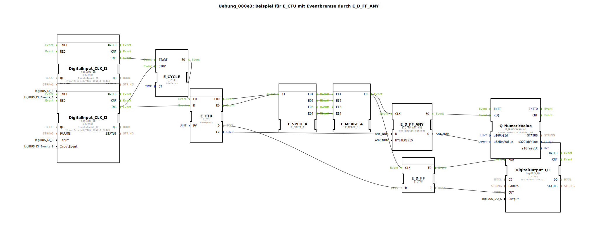

# Uebung_080e3: Beispiel für E_CTU mit Eventbremse durch E_D_FF_ANY

* * * * * * * * * *

## Einleitung

Diese Übung demonstriert den Einsatz des Funktionsbausteins **E_CTU** (Aufwärtszähler mit Ereignis-Steuerung) in Kombination mit einer **Eventbremse**, die durch einen **E_D_FF_ANY** (Flipflop mit Hysterese) realisiert wird. Durch das Zusammenspiel von zyklischen Zählimpulsen, manuellem Reset und einer Hysterese am Zählerwert wird ein Ausgangssignal nur dann geschaltet, wenn ein bestimmter Zählerstand erreicht und die Hysterese überschritten wird. Die Übung veranschaulicht die Verwendung von Ereignisverknüpfungen (E_SPLIT, E_MERGE) und die Ansteuerung einer digitalen Ausgabe sowie die Übergabe eines numerischen Werts an eine Ausgangsnummer.

## Verwendete Funktionsbausteine (FBs)

Die Übung enthält keine weiteren Subapplikationen, sondern verwendet ausschließlich Basis‑Funktionsbausteine aus den Bibliotheken `logiBUS`, `iec61499` und `isobus`. Nachfolgend werden die wichtigsten FBs beschrieben.

### DigitalInput_CLK_I1 & DigitalInput_CLK_I2

- **Typ**: `logiBUS::io::DI::logiBUS_IE`
- **Parameter**:
  - `QI` = `TRUE`
  - `Input` = `Input_I1` bzw. `Input_I2`
  - `InputEvent` = `BUTTON_SINGLE_CLICK`
- **Funktion**: Erfasst einen Tastendruck (Einfachklick) an den physischen Eingängen I1/I2 und gibt bei jeder positiven Flanke ein Ereignis `IND` aus.

### DigitalOutput_Q1

- **Typ**: `logiBUS::io::DQ::logiBUS_QX`
- **Parameter**:
  - `QI` = `TRUE`
  - `Output` = `Output_Q1`
- **Funktion**: Schaltet den digitalen Ausgang Q1 entsprechend dem anliegenden Datensignal `OUT`.

### E_CYCLE

- **Typ**: `iec61499::events::E_CYCLE`
- **Parameter**:
  - `DT` = `T#1ms` (Periodendauer 1 ms)
- **Funktion**: Erzeugt nach dem Start (Ereigniseingang `START`) in regelmäßigen Abständen von 1 ms ein Ereignis am Ausgang `EO`. Kann durch das Ereignis `STOP` angehalten werden.

### E_CTU

- **Typ**: `iec61499::events::E_CTU`
- **Parameter**:
  - `PV` = `UINT#5` (Vergleichswert 5)
- **Funktion**: Aufwärtszähler. Bei jedem Ereignis am Eingang `CU` wird der interne Zählerstand inkrementiert. Bei `R` (Reset) wird der Zähler auf 0 gesetzt. Am Ereignisausgang `CUO` wird nach jedem Zählimpuls ein Ereignis ausgegeben, am Ausgang `RO` bei Erreichen des Vergleichswerts `PV` (Zähler ≥ PV). Der aktuelle Zählerwert liegt am Datenausgang `CV` an, der boolesche Vergleichsstatus am Ausgang `Q`.

### E_SPLIT_4

- **Typ**: `iec61499::events::E_SPLIT_4`
- **Funktion**: Verteilt ein eingehendes Ereignis (Eingang `EI`) auf vier parallele Ausgänge (`EO1`…`EO4`).

### E_MERGE_4

- **Typ**: `iec61499::events::E_MERGE_4`
- **Funktion**: Führt bis zu vier eingehende Ereignisse (`EI1`…`EI4`) zu einem gemeinsamen Ereignisausgang `EO` zusammen (oder‑Verknüpfung).

### E_D_FF_ANY

- **Typ**: `logiBUS::signalprocessing::hysteresis::E_D_FF_ANY_HYS`
- **Parameter**:
  - `HYSTERESIS` = `UINT#25` (Hysteresebreite 25)
- **Funktion**: Ein Flipflop mit Hysterese. Bei einem Ereignis am Takteingang `CLK` wird der aktuelle Datenwert `D` (unsigned integer) übernommen. Der Ausgangswert `Q` wird nur dann aktualisiert, wenn die Differenz zum vorherigen Wert die Hysterese überschreitet. Dies verhindert ein ungewolltes Flackern bei geringen Änderungen. Der Ereignisausgang `EO` signalisiert eine Wertänderung.

### E_D_FF

- **Typ**: `iec61499::events::E_D_FF`
- **Funktion**: Standard‑D‑Flipflop. Bei jedem Ereignis am Takteingang `CLK` wird der Dateneingang `D` (boolesch) übernommen und am Ausgang `Q` ausgegeben. Ein Ereignis am Ausgang `EO` zeigt die Übernahme an.

### Q_NumericValue

- **Typ**: `isobus::UT::Q::Q_NumericValue`
- **Parameter**:
  - `u16ObjId` = `OutputNumber_N1`
- **Funktion**: Nimmt einen unsigned‑integer‑Wert am Dateneingang `u32NewValue` entgegen und gibt diesen bei einem Ereignis am Eingang `REQ` an die systemweit definierte Ausgangsnummer `N1` weiter (z. B. zur Anzeige auf einem Panel).

## Programmablauf und Verbindungen

Die Übung verfolgt folgenden Ablauf:

1. **Initialisierung**: Ein Tastendruck an **I1** erzeugt ein Ereignis `IND` vom Baustein `DigitalInput_CLK_I1`. Dieses startet den **E_CYCLE**, der nun kontinuierlich alle 1 ms ein Ereignis an seinem Ausgang `EO` erzeugt.

2. **Zählen**: Das periodische Ereignis von **E_CYCLE** wird an den Zähleingang `CU` des **E_CTU** geleitet. Der Zähler zählt bei jedem Impuls hoch. Bei jedem Zählschritt wird über den Ausgang `CUO` ein Ereignis ausgegeben, ebenso sobald der Zählerstand den Vergleichswert `PV` (5) erreicht oder überschreitet (Ausgang `RO`).

3. **Ereignisvervielfachung und -zusammenführung**: Beide Ereignisausgänge des Zählers (`CUO` und `RO`) werden über einen **E_SPLIT_4** auf vier parallele Kanäle aufgeteilt. Diese vier Kanäle werden anschließend über einen **E_MERGE_4** wieder zu einem einzigen Ereignisstrom zusammengeführt. Somit erzeugt jeder Zählimpuls und jeder PV‑Überschreitungsimpuls genau ein Ereignis am Ausgang des MERGE.

4. **Hysterese‑gesteuertes Flipflop**: Dieses zusammengeführte Ereignis wird einerseits an den Takteingang `CLK` des **E_D_FF_ANY** gelegt. Der Dateneingang `D` erhält den aktuellen Zählerwert `CV` des E_CTU. Der **E_D_FF_ANY** übernimmt diesen Wert nur dann, wenn sich der Wert um mindestens `HYSTERESIS` (25) geändert hat. Bei einer solchen signifikanten Änderung gibt er ein Ereignis am Ausgang `EO` aus und legt den geglätteten Wert an `Q` an.

5. **Wertausgabe**: Das Ereignis des **E_D_FF_ANY** wird an den Eingang `REQ` des **Q_NumericValue** weitergeleitet. Dieser übernimmt den geglätteten Zählerwert (`u32NewValue`) von `E_D_FF_ANY.Q` und stellt ihn an der Ausgangsnummer `N1` bereit (z. B. für eine numerische Anzeige).

6. **Digitalausgang parallel**: Das zusammengeführte Ereignis vom **E_MERGE_4** wird ebenfalls an den Takteingang `CLK` eines normalen **E_D_FF** gelegt. Der Dateneingang `D` erhält den booleschen Status `Q` des E_CTU („Zähler ≥ PV“). Somit wird bei jedem Zählimpuls der aktuelle Vergleichsstatus im Flipflop gespeichert und am Ausgang `Q` ausgegeben. Ein Ereignis am Ausgang `EO` des Flipflops steuert den **DigitalOutput_Q1** an, der den booleschen Wert auf den physischen Ausgang Q1 legt.

7. **Reset‑Funktion**: Ein Tastendruck an **I2** (zweiter Eingang) erzeugt ein Ereignis `IND` des **DigitalInput_CLK_I2**. Dieses Ereignis wird einerseits an den Reset‑Eingang `R` des E_CTU gelegt (Zähler wird auf 0 gesetzt) und andererseits an den `STOP`‑Eingang des E_CYCLE, wodurch die zyklische Erzeugung von Taktimpulsen angehalten wird. Somit wird der gesamte Zählvorgang zurückgesetzt und gestoppt.

## Zusammenfassung

Die Übung **Uebung_080e3** zeigt eine praxisnahe Kombination aus einem Ereignis‑gesteuerten Zähler (**E_CTU**), einer Hysterese‑basierten Wertglättung (**E_D_FF_ANY**) und einem booleschen Flipflop (**E_D_FF**). Durch das Zusammenspiel von **E_CYCLE**, **E_SPLIT_4** und **E_MERGE_4** wird ein robustes Ereignissystem aufgebaut, das den Zählerwert mit einer einstellbaren Hysterese überwacht und sowohl einen digitalen Ausgang als auch einen numerischen Wert ausgibt. Der Reset über einen zweiten Taster ermöglicht das Zurücksetzen und Stoppen der Zählung. Die Übung vermittelt grundlegende Konzepte der ereignisgesteuerten Steuerungstechnik, insbesondere die Verwendung von Ereignisverzweigungen, Zusammenführungen und die Bedeutung von Hysteresen bei der Signalverarbeitung.