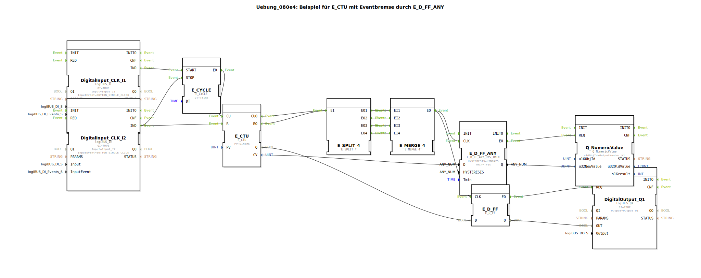

# Uebung_080e4: Beispiel für E_CTU mit Eventbremse durch E_D_FF_ANY

* * * * * * * * * *

## Einleitung

Diese Übung demonstriert den Einsatz eines **E_CTU** (Event-Zählers) in Kombination mit einer **Eventbremse**, realisiert durch einen **E_D_FF_ANY** (E_D_FlipFlop mit Hysterese und Minimalzeit). Ziel ist es, das Zählergebnis nur dann an eine numerische Ausgabe weiterzuleiten, wenn der Zählwert für eine bestimmte Zeit stabil ist. Dadurch werden Prellen oder kurzzeitige Änderungen unterdrückt.

## Verwendete Funktionsbausteine (FBs)

| Bausteinname | Typ | Parameter / Bemerkung |
|-------------|------|-----------------------|
| `DigitalInput_CLK_I1` | `logiBUS::io::DI::logiBUS_IE` | `Input = Input_I1`, `InputEvent = BUTTON_SINGLE_CLICK` |
| `DigitalInput_CLK_I2` | `logiBUS::io::DI::logiBUS_IE` | `Input = Input_I2`, `InputEvent = BUTTON_SINGLE_CLICK` |
| `E_CYCLE` | `iec61499::events::E_CYCLE` | `DT = T#1ms` (Taktgeber für Zählimpulse) |
| `E_CTU` | `iec61499::events::E_CTU` | `PV = UINT#5` (Zählschwelle) |
| `E_SPLIT_4` | `iec61499::events::E_SPLIT_4` | Verteilt ein Ereignis auf vier Ausgänge |
| `E_MERGE_4` | `iec61499::events::E_MERGE_4` | Sammelt Ereignisse von vier Eingängen zu einem Ausgang |
| `E_D_FF_ANY` | `logiBUS::signalprocessing::hysteresis::E_D_FF_ANY_HYS_TMIN` | `HYSTERESIS = UINT#25`, `Tmin = T#1s` (Hysterese und Mindestzeit für stabilen Zustand) |
| `E_D_FF` | `iec61499::events::E_D_FF` | Standard-D-Flipflop für binäre Ausgabe |
| `Q_NumericValue` | `isobus::UT::Q::Q_NumericValue` | `u16ObjId = OutputNumber_N1` (Ausgabe eines numerischen Wertes) |
| `DigitalOutput_Q1` | `logiBUS::io::DQ::logiBUS_QX` | `Output = Output_Q1` (digitaler Ausgang) |

## Programmablauf und Verbindungen

### Ereignis- und Datenfluss

1. **Zählimpulse generieren**  
   Der Taktgeber `E_CYCLE` wird gestartet, sobald `DigitalInput_CLK_I1` ein Ereignis (`IND`) sendet. Stoppt wird er durch ein Ereignis von `DigitalInput_CLK_I2`.  
   Der zyklische Ereignisausgang `EO` von `E_CYCLE` triggert den **Zähleingang `CU`** von `E_CTU`.

2. **Zähler rücksetzen**  
   Ein Ereignis von `DigitalInput_CLK_I2` wird zusätzlich an den **Reset-Eingang `R`** von `E_CTU` geleitet.

3. **Zählerausgänge**  
   Der Zähler gibt zwei Ereignisse aus:
   - `CUO` (Counter Overflow) – wird aktiv, wenn der Zählerstand `CV` den Parameter `PV` (hier 5) erreicht.
   - `RO` (Reset Overflow) – wird aktiv, wenn der Zähler zurückgesetzt wird und dabei den Bereich übersteigt (hier nicht relevant, aber beide Ereignisse werden verwendet).

4. **Ereignisverteilung und -zusammenführung**  
   `CUO` und `RO` werden gemeinsam auf den Eingang `EI` von `E_SPLIT_4` geschaltet.  
   `E_SPLIT_4` verteilt jedes ankommende Ereignis auf alle vier Ausgänge `EO1`…`EO4`. Diese vier Ausgänge sind mit den vier Eingängen `EI1`…`EI4` von `E_MERGE_4` verbunden.  
   **Effekt:** Jedes Ereignis von `E_CTU` (egal ob `CUO` oder `RO`) wird sofort an den Ausgang `EO` von `E_MERGE_4` weitergegeben – es entsteht eine **logische ODER-Verknüpfung** der beiden Ereignisse.

5. **Eventbremse durch `E_D_FF_ANY`**  
   Das zusammengeführte Ereignis speist den **Taktingang `CLK`** von `E_D_FF_ANY`. Dieser Baustein übernimmt den **Datenwert `D`** (den aktuellen Zählerstand `CV`) nur dann an den Ausgang `Q`, wenn der Wert für mindestens `Tmin = 1s` stabil bleibt (Hysterese von `25` Einheiten).  
   Dadurch werden kurze Spitzen auf dem Zählerstand gefiltert.

6. **Numerische Ausgabe**  
   Der stabile Zählerstand `Q` von `E_D_FF_ANY` wird über die Datenverbindung an den Eingang `u32NewValue` von `Q_NumericValue` übergeben. Das Ereignis `EO` von `E_D_FF_ANY` triggert die Ausgabe über den `REQ`-Eingang.

7. **Digitaler Ausgang**  
   Parallel dazu wird das gleiche zusammengeführte Ereignis von `E_MERGE_4` auch an den **Taktingang `CLK`** eines normalen `E_D_FF` geleitet. Dieser übernimmt den **binären Datenwert `Q`** von `E_CTU` (den Zählerstatus: ob Schwelle erreicht) und gibt ihn über `EO` an `DigitalOutput_Q1` weiter.  
   Der Ausgang `DigitalOutput_Q1` schaltet also immer dann ein, wenn der Zähler gerade seinen Endwert erreicht oder zurückgesetzt wird.

### Lernziele

- Verständnis von **E_CTU (Event Counter)** und seinen Ereignisausgängen `CUO` und `RO`.
- Einsatz von **E_SPLIT_4** und **E_MERGE_4** zur Ereignissteuerung.
- Anwendung eines **E_D_FF_ANY mit Hysterese und Mindestzeit** zur Unterdrückung kurzzeitiger Änderungen (Eventbremse).
- Zusammenspiel von **numerischen und digitalen Ausgaben** basierend auf Zählerereignissen.

### Schwierigkeitsgrad

**Fortgeschritten** – Grundkenntnisse in 4diac-IDE und IEC 61499 Ereignis-/Datenflüssen werden vorausgesetzt.

### Benötigte Vorkenntnisse

- Grundlagen der 4diac-IDE: Erstellen von Subapplikationen, Verbinden von Bausteinen.
- Verständnis von Ereignis- und Datenkanten.
- Umgang mit logiBUS- bzw. isobus-Bibliotheken (bei Verwendung der Hardware-Simulation).

### Starten der Übung

1. Importieren Sie die Subapplikation `Uebung_080e4` in Ihr 4diac-Projekt.
2. Stellen Sie sicher, dass die benötigten Bibliotheken (`logiBUS`, `iec61499`, `isobus`) verfügbar sind.
3. Weisen Sie die Ein-/Ausgänge `Input_I1`, `Input_I2`, `Output_Q1` und `OutputNumber_N1` passenden Hardware- oder Simulationsadressen zu.
4. Starten Sie die Ausführung und beobachten Sie das Verhalten beim Drücken der Taster (I1 Takt starten/stoppen, I2 Reset).

## Zusammenfassung

Die Übung veranschaulicht, wie ein **E_CTU** mit Hilfe von **E_D_FF_ANY** und **E_D_FF** sowohl einen **stabilisierten Zählwert** als auch einen **sofortigen Binärstatus** ausgeben kann. Die Ereignisverarbeitung über Split/Merge sorgt dafür, dass sowohl Überlauf- als auch Rücksetzereignisse gleichberechtigt behandelt werden. Dies ist typisch für Anwendungen, bei denen ein Zählerwert erst nach einer gewissen Beruhigungszeit weiterverarbeitet werden soll (z. B. Entprellung von Sensordaten).