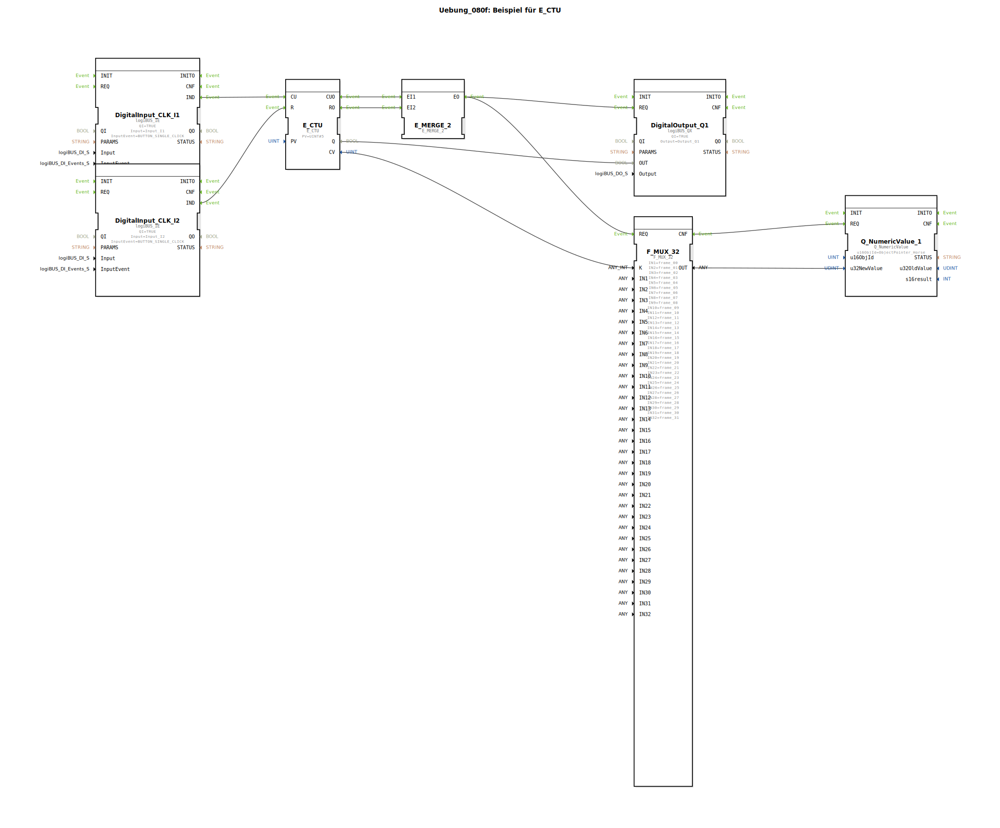

# Uebung_080f: Beispiel für E_CTU

* * * * * * * * * *

## Einleitung

Diese Übung demonstriert die Verwendung des ereignisgesteuerten Aufwärtszählers `E_CTU` nach IEC 61499. Mit zwei Tastern wird der Zähler erhöht bzw. zurückgesetzt. Der aktuelle Zählerstand wird auf einem numerischen Display als animiertes Pferd (Einzelframes) dargestellt. Sobald der Zähler den vorgegebenen Grenzwert erreicht, wird ein digitaler Ausgang gesetzt.

Die Übung eignet sich für Anwender, die erste Schritte mit Zählern und Ereignisverkettungen in 4diac machen möchten.

## Verwendete Funktionsbausteine (FBs)

### Sub-Bausteine: Eingabe-Logik (Taster)

- **DigitalInput_CLK_I1 (Typ: `logiBUS::io::DI::logiBUS_IE`)**
    - Parameter:
        - `QI` = `TRUE`
        - `Input` = `Input_I1`
        - `InputEvent` = `BUTTON_SINGLE_CLICK`
    - Funktion: Stellt den ersten Taster (I1) als Ereignisquelle bereit. Jeder einfache Klick erzeugt ein Ereignis `IND`.
- **DigitalInput_CLK_I2 (Typ: `logiBUS::io::DI::logiBUS_IE`)**
    - Parameter:
        - `QI` = `TRUE`
        - `Input` = `Input_I2`
        - `InputEvent` = `BUTTON_SINGLE_CLICK`
    - Funktion: Stellt den zweiten Taster (I2) als Ereignisquelle bereit. Jeder einfache Klick erzeugt ein Ereignis `IND`.

### Sub-Baustein: Aufwärtszähler

- **E_CTU (Typ: `iec61499::events::E_CTU`)**
    - Parameter:
        - `PV` = `UINT#5` (Grenzwert)
    - Funktion: Ein ereignisgesteuerter Aufwärtszähler. Jedes Ereignis am Eingang `CU` erhöht den internen Zähler CV um 1 und löst `CUO` aus. Ein Ereignis am Eingang `R` setzt den Zähler auf 0 zurück und löst `RO` aus. Der Ausgang `Q` wird `TRUE`, sobald `CV >= PV`.

### Sub-Baustein: Ereigniszusammenführung

- **E_MERGE_2 (Typ: `iec61499::events::E_MERGE_2`)**
    - Funktion: Fasst zwei Ereigniseingänge (`EI1`, `EI2`) zu einem gemeinsamen Ereignisausgang `EO` zusammen. Sobald eines der beiden Ereignisse eintrifft, wird `EO` ausgelöst.

### Sub-Baustein: Ausgabe-Logik (digitaler Ausgang)

- **DigitalOutput_Q1 (Typ: `logiBUS::io::DQ::logiBUS_QX`)**
    - Parameter:
        - `QI` = `TRUE`
        - `Output` = `Output_Q1`
    - Funktion: Schaltet den digitalen Ausgang Q1. Der Wert am Dateneingang `OUT` wird übernommen, wenn ein Ereignis an `REQ` eintrifft.

### Sub-Baustein: Multiplexer

- **F_MUX_32 (Typ: `iec61131::selection::F_MUX_32`)**
    - Parameter:
        - `IN1` … `IN32` = Konstanten `frame_00` … `frame_31` (32 Einzelframes einer Pferdeanimation)
    - Funktion: Ein 32-fach Multiplexer. Je nach Wert am Auswahleingang `K` (0 … 31) wird der entsprechende Dateingang `INx` an den Ausgang `OUT` durchgeschaltet.

### Sub-Baustein: Numerische Anzeige

- **Q_NumericValue_1 (Typ: `isobus::UT::Q::Q_NumericValue`)**
    - Parameter:
        - `u16ObjId` = `ObjectPointer_Horse`
    - Funktion: Zeigt einen übergebenen 32-Bit-Wert (`u32NewValue`) numerisch an (hier: als animiertes Pferd über die Einzelframes). Ein Ereignis an `REQ` aktualisiert die Anzeige.

## Programmablauf und Verbindungen

Der Ablauf wird durch Ereignisse gesteuert:

1. **Zählereingang**  
   - Ein Klick auf Taster I1 erzeugt ein Ereignis `IND` am Baustein `DigitalInput_CLK_I1`.  
   - Dieses Ereignis wird direkt an den Eingang `CU` von `E_CTU` geleitet. Der Zähler erhöht sich um 1.

2. **Reset**  
   - Ein Klick auf Taster I2 erzeugt ein Ereignis `IND` an `DigitalInput_CLK_I2`.  
   - Dieses Ereignis wird an den Eingang `R` von `E_CTU` geleitet. Der Zähler wird auf 0 zurückgesetzt.

3. **Ereigniszusammenführung**  
   - Sowohl der Ausgang `CUO` (nach Zählererhöhung) als auch `RO` (nach Reset) von `E_CTU` werden an die Eingänge `EI1` und `EI2` des `E_MERGE_2` gelegt.  
   - Der zusammengeführte Ausgang `EO` wird bei jeder Zähleränderung aktiv.

4. **Aktualisierung der Anzeige und des Ausgangs**  
   - Das gemeinsame Ereignis `EO` wird parallel an zwei Bausteine weitergeleitet:  
     - **Multiplexer**: Das Ereignis erreicht den `REQ`-Eingang von `F_MUX_32`. Der aktuelle Zählerstand `CV` (Datenverbindung von `E_CTU.CV` zu `F_MUX_32.K`) wählt das passende Frame aus. Der Multiplexer gibt das gewählte Frame an seinem Ausgang `OUT` aus.  
     - **Digitale Anzeige**: Nachdem der Multiplexer fertig ist (`CNF`-Ereignis), wird das Ereignis an den `REQ`-Eingang von `Q_NumericValue_1` weitergegeben. Der Datenwert `OUT` des Multiplexers wird als neuer Anzeigewert übernommen.  
   - Gleichzeitig wird das Ereignis `EO` auch an den `REQ`-Eingang von `DigitalOutput_Q1` gelegt. Der logische Wert `Q` von `E_CTU` (TRUE wenn `CV >= 5`) wird auf den Ausgang Q1 geschrieben.

5. **Kommentare im Netzwerk**  
   - Ein Kommentar weist darauf hin, dass eine Typkonvertierung von `UINT` nach `UDINT` bei der Verbindung `CV` → `K` nicht notwendig ist, da `UDINT` immer einen `UINT` aufnehmen kann.  
   - Ein weiterer Kommentar erklärt, dass der `E_MERGE_2` zwar weggelassen werden könnte, aber die Verwendung den Code sauberer hält (Vermeidung von sich kreuzenden Leitungen).

## Zusammenfassung

Die Übung veranschaulicht den praktischen Einsatz eines ereignisgesteuerten Aufwärtszählers (`E_CTU`) in einer 4diac-Umgebung. Lernerfekt:

- Verständnis des Zusammenspiels von Ereignis- und Datenflüssen.
- Anwendung eines Zählers mit Ereignis-Reset.
- Nutzung eines Multiplexers zur Auswahl von Konstanten (Bildframes).
- Kombination von Hardware-Eingängen (Taster) und Ausgängen (digitaler Ausgang, Display).

Voraussetzungen: Grundkenntnisse der IEC 61499 Ereignisverarbeitung und der 4diac-IDE. Die Übung kann direkt in einem Simulationsprojekt oder auf echter logiBUS-Hardware ausgeführt werden.