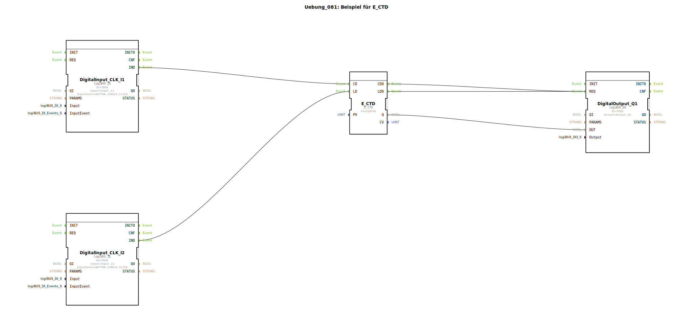

# Uebung_081: Beispiel für E_CTD

Dieser Artikel beschreibt die logiBUS®-Übung `Uebung_081`. Hier wird das Prinzip des Rückwärtszählens bis zum Erreichen der Nullgrenze gezeigt.

----

## Ziel der Übung

Verwendung des Bausteins `E_CTD` (Event Count Down). Es wird demonstriert, wie ein Zähler mit einem Startwert geladen und durch Ereignisse bis auf Null dekrementiert wird.

-----

## Beschreibung und Komponenten

[cite_start]In `Uebung_081.SUB` wird ein Down-Counter zur Steuerung eines Ausgangs verwendet[cite: 1].

### Funktionsbausteine (FBs)

  * **`I1` (Count Down)**: Verringert den Zählerstand bei jedem Klick.
  * **`I2` (Load)**: Lädt den Zähler mit dem Vorgabewert (`PV`).
  * **`E_CTD`**: Der Zähler-Baustein. [cite_start]Der Parameter `PV` ist auf 5 eingestellt[cite: 1].
  * **`DigitalOutput_Q1`**: Signalisiert das Erreichen der Nullgrenze.

-----

## Funktionsweise

1.  **Laden**: Ein Klick auf **I2** triggert den Eingang `LD`. Der Zählerstand springt sofort auf 5. Der Ausgang `Q` wird `FALSE`.
2.  **Zählen**: Jeder Klick auf **I1** (`CD`) verringert den Zählerstand (4, 3, 2, 1, 0).
3.  **Grenzwert**: Sobald der Stand Null erreicht (`CV <= 0`), wechselt der Ausgang `Q` auf `TRUE`.
4.  Die Lampe an **Q1** leuchtet auf.

-----

## Anwendungsbeispiel

**Restmengen-Anzeige**:
In einem Saatgutbehälter befinden sich 5 Einheiten. Bei jeder Umdrehung der Dosierung wird ein Impuls (`CD`) ausgelöst. Sobald der Zähler bei Null ankommt, wird ein Alarm (`Q1`) ausgegeben, um den Fahrer zum Nachfüllen aufzufordern.