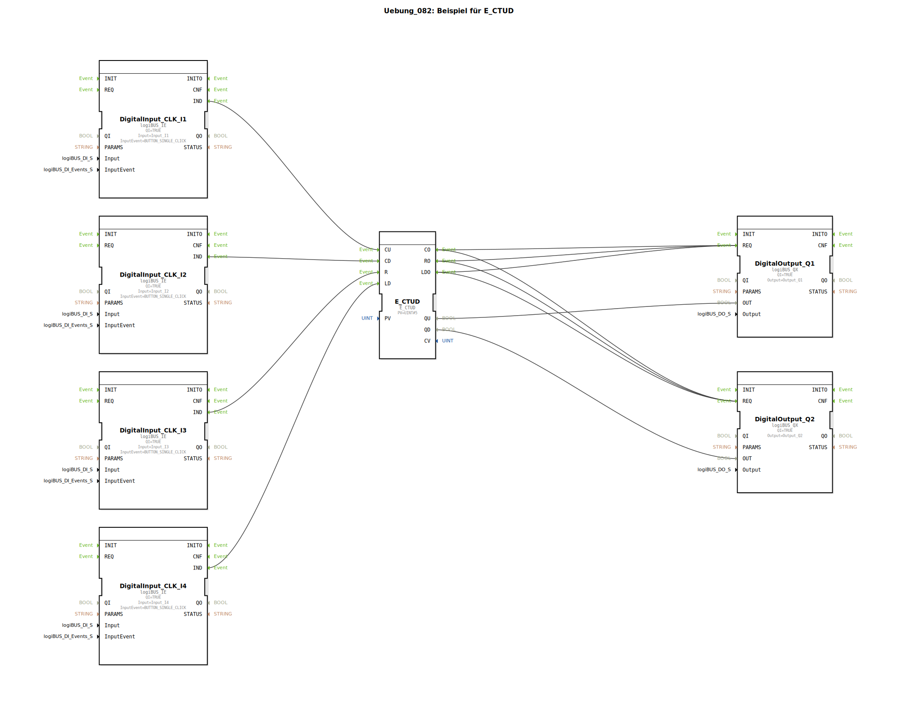

# Uebung_082: Beispiel für E_CTUD

Dieser Artikel beschreibt die logiBUS®-Übung `Uebung_082`. Hier werden beide Zählrichtungen in einem Baustein kombiniert.

----

## Ziel der Übung

Verwendung des Bausteins `E_CTUD` (Event Count Up/Down). Es wird gezeigt, wie man den Füllstand eines Speichers verwaltet, der sowohl Zu- als auch Abflüsse hat.

-----

## Beschreibung und Komponenten

[cite_start]Die Subapplikation `Uebung_082.SUB` nutzt vier Taster zur vollständigen Kontrolle des Zählers[cite: 1].

### Funktionsbausteine (FBs)

  * **`I1` (CU)**: Zählt aufwärts.
  * **`I2` (CD)**: Zählt abwärts.
  * **`I3` (R)**: Setzt den Zähler auf Null.
  * **`I4` (LD)**: Lädt den Zähler mit dem Wert 5 (`PV`).
  * **`Q1` (Upper Limit)**: Leuchtet, wenn der Zählerstand >= 5 ist.
  * **`Q2` (Lower Limit)**: Leuchtet, wenn der Zählerstand <= 0 ist.

-----

## Funktionsweise

Der Baustein überwacht zwei Schwellwerte gleichzeitig:
*   Der Ausgang `QU` reagiert auf die Obergrenze (`PV`).
*   Der Ausgang `QD` reagiert auf die Untergrenze (Null).

Dies ermöglicht eine lückenlose Überwachung von Beständen oder Positionen innerhalb eines definierten Arbeitsbereichs.