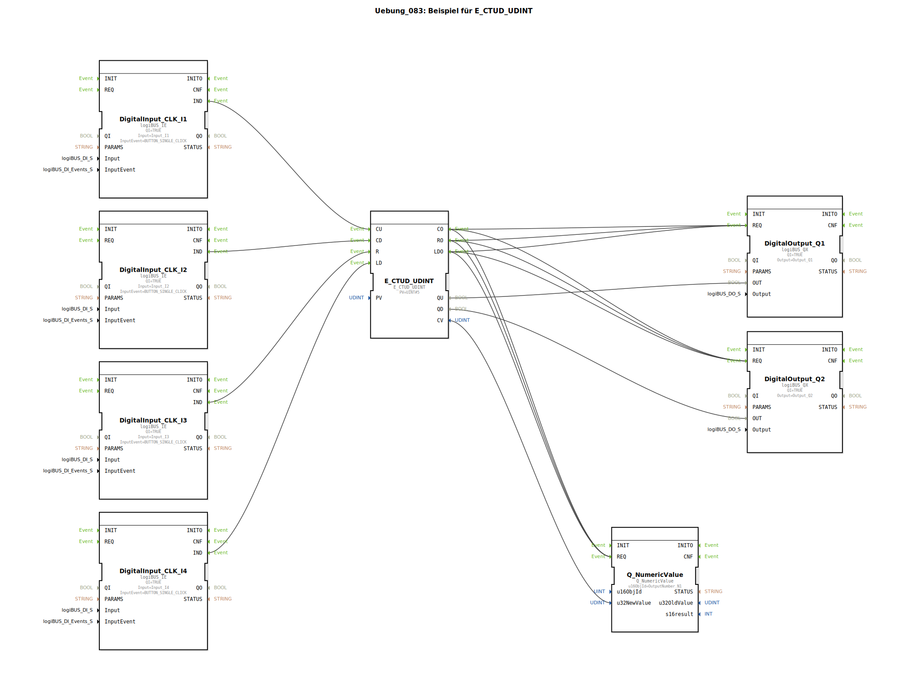

# Uebung_083: Beispiel für E_CTUD_UDINT

Dieser Artikel beschreibt die logiBUS®-Übung `Uebung_083`.

## 🎧 Podcast

* ["Store Version" – Dein Schlüssel zur Verwaltung von Objektdatenpools im nichtflüchtigen VT-Speicher (ISO 11783-6)](https://podcasters.spotify.com/pod/show/isobus-vt-objects/episodes/Store-Version--Dein-Schlssel-zur-Verwaltung-von-Objektdatenpools-im-nichtflchtigen-VT-Speicher-ISO-11783-6-e36vfh0)
* [ISO 11783-6: Softkeys und das Virtual Terminal verstehen – Dein Schlüssel zur Landmaschinen-Mechatronik](https://podcasters.spotify.com/pod/show/isobus-vt-objects/episodes/ISO-11783-6-Softkeys-und-das-Virtual-Terminal-verstehen--Dein-Schlssel-zur-Landmaschinen-Mechatronik-e36a8b0)
* [ISOBUS Skalierung: Wenn der Ackerschlepper-Bildschirm nicht passt – Eine Einführung in ISO 11783-6](https://podcasters.spotify.com/pod/show/isobus-vt-objects/episodes/ISOBUS-Skalierung-Wenn-der-Ackerschlepper-Bildschirm-nicht-passt--Eine-Einfhrung-in-ISO-11783-6-e36a8q6)
* [ISOBUS-Balkendiagramm: Das Output Linear Bar Graph Objekt der ISO 11783-6 entschlüsselt](https://podcasters.spotify.com/pod/show/isobus-vt-objects/episodes/ISOBUS-Balkendiagramm-Das-Output-Linear-Bar-Graph-Objekt-der-ISO-11783-6-entschlsselt-e36l0v2)
* [ISOBUS-Bedienoberflächen: Wenn Tasten und Hauptanzeige unterschiedlich skalieren – ISO 11783-6 entschlüsselt](https://podcasters.spotify.com/pod/show/isobus-vt-objects/episodes/ISOBUS-Bedienoberflchen-Wenn-Tasten-und-Hauptanzeige-unterschiedlich-skalieren--ISO-11783-6-entschlsselt-e36a8n8)

----

## Übersicht

[cite_start]Diese Übung verwendet den Baustein `E_CTUD_UDINT`[cite: 1]. Im Gegensatz zum Standard-Zähler (der meist nur bis 65.535 zählt) nutzt dieser Typ den Datentyp `UDINT` (Unsigned Double Integer). Damit können Ereignisse bis zu einem Wert von über 4 Milliarden gezählt werden.
Zusätzlich zur Ansteuerung der Lampen `Q1` und `Q2` wird der aktuelle Zählerstand (`CV`) direkt an eine numerische Anzeige am ISOBUS-Terminal gesendet. Dies ermöglicht eine genaue Beobachtung des Zählvorgangs in Echtzeit.