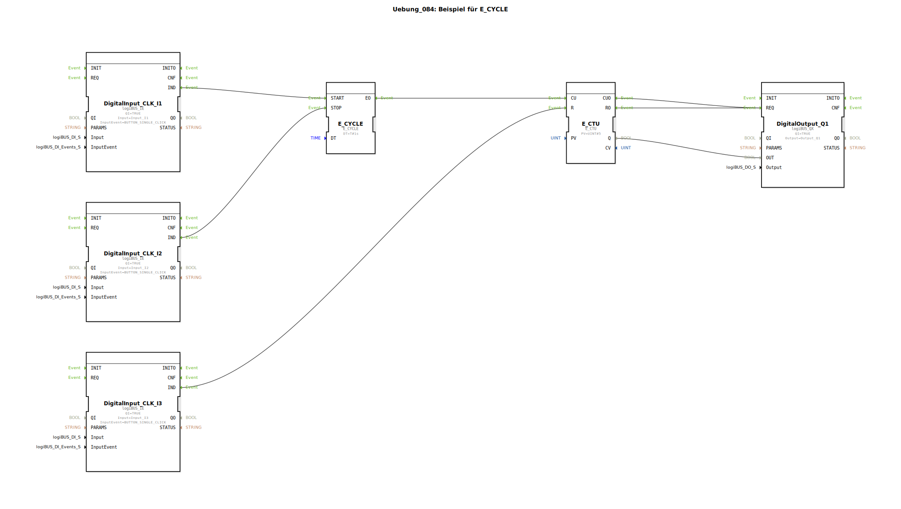

# Uebung_084: Beispiel für E_CYCLE

Dieser Artikel beschreibt die logiBUS®-Übung `Uebung_084`. Hier wird der Zähler nicht manuell, sondern durch einen Taktgeber gesteuert.

----

## Ziel der Übung

Kombination von Zeitbasis (`E_CYCLE`) und Ereignis-Zähler (`E_CTU`).

-----

## Funktionsweise

[cite_start]In `Uebung_084.SUB` wird der Zähler automatisch jede Sekunde inkrementiert[cite: 1].

*   Taster **I1** startet den Taktgeber.
*   Jedes Sekunde-Event vom `E_CYCLE` erreicht den `CU`-Eingang des Zählers.
*   Nach 5 Sekunden erreicht der Zähler den Wert 5 und die Lampe `Q1` geht an.
*   Taster **I2** stoppt den Taktgeber (Pause).
*   Taster **I3** setzt den Zähler auf Null zurück.

Dies ist die Basis für die Implementierung von Zeit-Grenzwerten oder verzögerten Abschaltungen über längere Zeiträume.