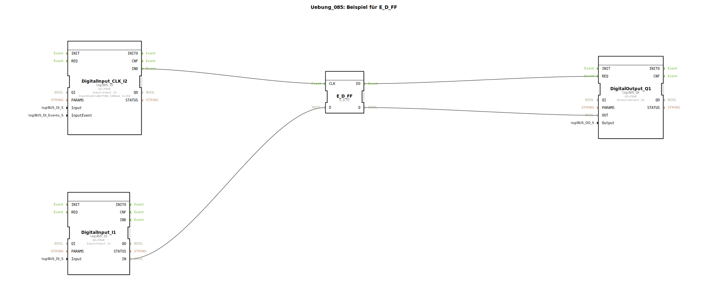

# Uebung_085: Beispiel für E_D_FF

Dieser Artikel beschreibt die logiBUS®-Übung `Uebung_085`. Hier wird das Prinzip des D-Flip-Flops (Delay- oder Data-FF) vorgestellt.

## 🎧 Podcast

* [Das Relais im Detail: Schaltverstärker, Schutz und die Geheimnisse von A1/A2, 85/86 und der Hysterese](https://podcasters.spotify.com/pod/show/ms-muc-lama/episodes/Das-Relais-im-Detail-Schaltverstrker--Schutz-und-die-Geheimnisse-von-A1A2--8586-und-der-Hysterese-e3audsc)

----

## Ziel der Übung

Verwendung des Bausteins `E_D_FF`. Ziel ist es, einen Datenwert (TRUE/FALSE) erst in dem Moment zu übernehmen, in dem ein taktendendes Ereignis eintrifft.

-----

## Beschreibung und Komponenten

[cite_start]Die Subapplikation `Uebung_085.SUB` nutzt einen Daten-Eingang und einen Klick-Ereignis-Eingang[cite: 1].

### Funktionsbausteine (FBs)

  * **`I1` (Data)**: Liefert den Soll-Zustand.
  * **`I2` (Clock)**: Liefert den Übernahme-Impuls.
  * **`E_D_FF`**: Der Speicherbaustein. [cite_start]Er übernimmt den Wert am Eingang `D` nur dann an den Ausgang `Q`, wenn ein Ereignis am Eingang `CLK` empfängt[cite: 1].

-----

## Funktionsweise

Der Ausgang `Q1` folgt nicht sofort dem Schalter `I1`.
1.  Der Nutzer stellt den Schalter `I1` auf TRUE. Am Ausgang passiert nichts.
2.  Erst wenn der Nutzer zusätzlich auf Taster **I2** klickt, wird das `TRUE` in das Flip-Flop geladen und die Lampe geht an.
3.  Wird `I1` wieder auf FALSE gestellt, bleibt die Lampe so lange an, bis erneut ein Klick auf **I2** erfolgt.

Dies ist eine fundamentale Methode zur zeitlichen Synchronisation von Signalen in der Digitaltechnik.