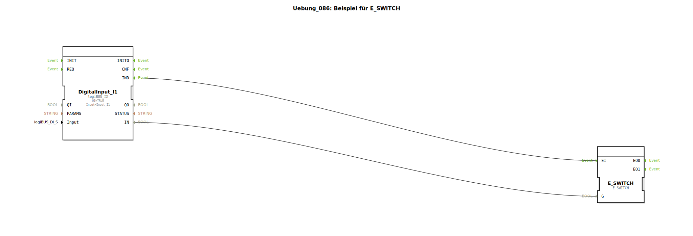

# Uebung_086: Beispiel für E_SWITCH

Dieser Artikel beschreibt die logiBUS®-Übung `Uebung_086`.

## 📺 Video

* [Der Katalog von 1863](https://www.youtube.com/watch?v=fk7tIjl2pTk)

## 🎧 Podcast

* [Das Relais im Detail: Schaltverstärker, Schutz und die Geheimnisse von A1/A2, 85/86 und der Hysterese](https://podcasters.spotify.com/pod/show/ms-muc-lama/episodes/Das-Relais-im-Detail-Schaltverstrker--Schutz-und-die-Geheimnisse-von-A1A2--8586-und-der-Hysterese-e3audsc)
* [Das Technologie-Panorama von 1863: Lanz & Comp. und die Revolution der deutschen Landwirtschaft durch Import, Innovation und Guano](https://podcasters.spotify.com/pod/show/ms-muc-lama/episodes/Das-Technologie-Panorama-von-1863-Lanz--Comp--und-die-Revolution-der-deutschen-Landwirtschaft-durch-Import--Innovation-und-Guano-e39auqa)

----

## Übersicht

[cite_start]Verwendung des fundamentalen Bausteins `E_SWITCH`[cite: 1].
In dieser Übung wird demonstriert, wie ein Ereignis-Strom (`EI`) basierend auf einem logischen Zustand (`G`) auf zwei verschiedene Pfade aufgeteilt wird.
*   Ist der Schalter `I1` auf `FALSE`, landet das `IND`-Ereignis am Ausgang `EO0`.
*   Ist der Schalter `I1` auf `TRUE`, landet das `IND`-Ereignis am Ausgang `EO1`.
Dies ist die Basis für jede bedingte Programmausführung ("If-Then-Else") in der IEC 61499.