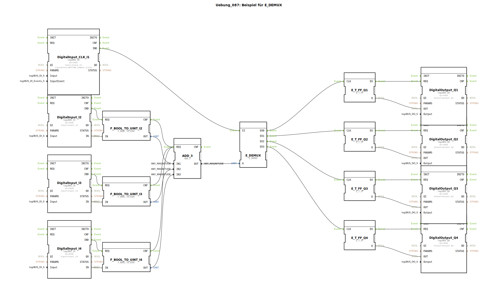

# Uebung_087: Beispiel für E_DEMUX

Dieser Artikel beschreibt die logiBUS®-Übung `Uebung_087`. Hier wird die Auswahl eines Ereignispfads durch eine Kombination von Logikwerten demonstriert.

----

## Ziel der Übung

Verwendung des `E_DEMUX` (Event Demultiplexer). Es wird gezeigt, wie ein zentrales "Ausführ-Ereignis" (Klick auf Taster 1) an verschiedene Aktoren geleitet wird, wobei die Auswahl über die Kombination anderer Taster getroffen wird.

-----

## Beschreibung und Komponenten

[cite_start]Die Subapplikation `Uebung_087.SUB` nutzt eine Additions-Logik, um den Selektor-Eingang des Demultiplexers zu steuern[cite: 1].

### Funktionsbausteine (FBs)

  * **`I1` (Trigger)**: Das Ereignis, das verteilt werden soll.
  * **`I2`, `I3`, `I4` (Selector)**: Bestimmen das Ziel.
  * **`ADD_3`**: Summiert die Zustände der Taster 2, 3 und 4 auf.
  * **`E_DEMUX`**: Leitet das Event von `I1` an den Ausgang weiter, dessen Nummer der berechneten Summe entspricht.

-----

## Funktionsweise

Die Anzahl der gedrückten "Wahl-Taster" bestimmt, welche Lampe beim Klick auf **I1** toggelt:
*   Kein Wahl-Taster gedrückt ➡️ Summe = 0 ➡️ Klick auf I1 toggelt **Q1**.
*   Ein Wahl-Taster gedrückt ➡️ Summe = 1 ➡️ Klick auf I1 toggelt **Q2**.
*   Zwei Wahl-Taster gedrückt ➡️ Summe = 2 ➡️ Klick auf I1 toggelt **Q3**.
*   Alle drei Wahl-Taster gedrückt ➡️ Summe = 3 ➡️ Klick auf I1 toggelt **Q4**.

-----

## Anwendungsbeispiel

**Indirekte Adressierung**:
Ein Bediener wählt über Kippschalter an seinem Bedienpult eine Gruppe von Düsen aus. Erst wenn er den zentralen Fußtaster (`I1`) betätigt, wird der Befehl an die gewählte Gruppe gesendet.