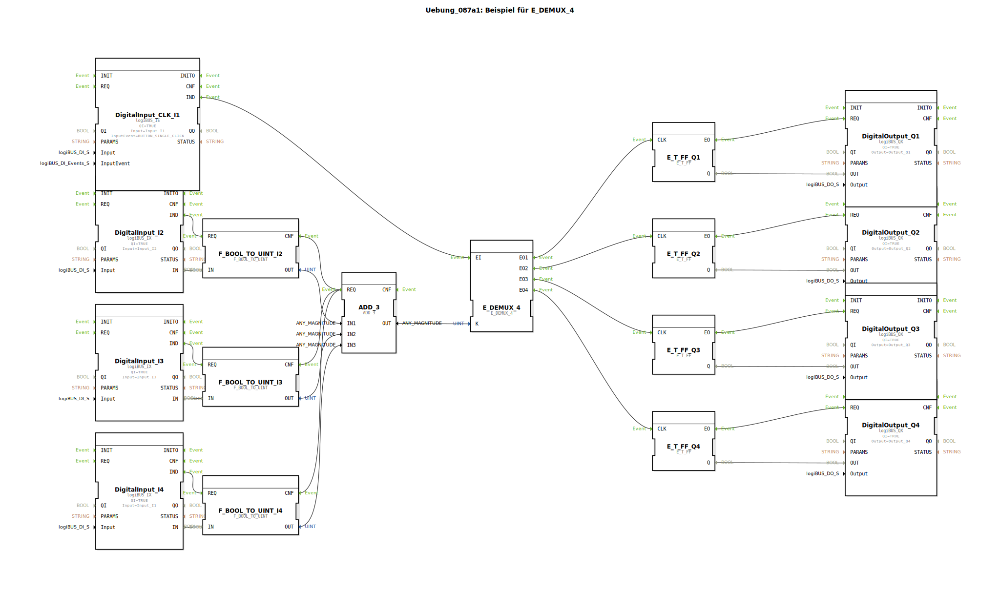

# Uebung_087a1: Beispiel für E_DEMUX_4

* * * * * * * * * *

## Einleitung
Diese Übung demonstriert die Verwendung des E_DEMUX_4-Bausteins in einem Steuerungssystem. Das Programm zählt die Anzahl aktiver Eingänge und verteilt Ereignisse entsprechend auf verschiedene Ausgänge. Die Übung zeigt die Kombination von Ereignisverarbeitung und Datenverarbeitung in einem IEC 61499-System.

## Verwendete Funktionsbausteine (FBs)

### Hauptbausteine:
- **E_DEMUX_4**: Ereignis-Demultiplexer mit 4 Ausgängen
- **ADD_3**: Addierer mit 3 Eingängen
- **E_T_FF**: T-Flipflop (4 Instanzen für Q1-Q4)
- **F_BOOL_TO_UINT**: Typkonvertierung von BOOL zu UINT (3 Instanzen)
- **logiBUS_IX**: Digitale Eingänge (4 Instanzen)
- **logiBUS_QX**: Digitale Ausgänge (4 Instanzen)

### Sub-Bausteine:
- **logiBUS_IX** (Digitale Eingänge)
  - **Typ**: Hardware-Eingangsbaustein
  - **Parameter**: 
    - QI = TRUE (aktiviert)
    - Input = logiBUS_DI::Input_Ix (Hardware-Zuordnung)
    - InputEvent = logiBUS_DI_Events::BUTTON_SINGLE_CLICK (nur bei CLK_I1)

- **logiBUS_QX** (Digitale Ausgänge)
  - **Typ**: Hardware-Ausgangsbaustein
  - **Parameter**:
    - QI = TRUE (aktiviert)
    - Output = logiBUS_DO::Output_Qx (Hardware-Zuordnung)

## Programmablauf und Verbindungen

### Signalfluss:
1. **Eingangsverarbeitung**: 
   - Drei digitale Eingänge (I2, I3, I4) werden über F_BOOL_TO_UINT in UINT-Werte konvertiert
   - Ein spezieller Takt-Eingang (CLK_I1) mit Einzelklick-Erkennung

2. **Berechnung**:
   - Die drei UINT-Werte werden im ADD_3-Baustein summiert
   - Das Ergebnis bestimmt den Ausgangskanal des E_DEMUX_4

3. **Ereignisverteilung**:
   - E_DEMUX_4 verteilt das Takt-Ereignis auf einen von vier Ausgängen basierend auf der Summe
   - 0 aktive Tasten → Q1
   - 1 aktive Taste → Q2  
   - 2 aktive Tasten → Q3
   - 3 aktive Tasten → Q4

4. **Ausgangssteuerung**:
   - Vier T-Flipflops (E_T_FF) schalten die entsprechenden Ausgänge (Q1-Q4) bei jedem Takt-Ereignis

### Verbindungen:
- **Ereignisverbindungen**: Verknüpfen IND-Ereignisse der Eingänge mit REQ-Ereignissen der Konverter und weiter zum ADD_3 und E_DEMUX_4
- **Datenverbindungen**: Übertragen die Eingangszustände durch die Konvertierung zur Addition und weiter zum Demultiplexer

### Lernziele:
- Verständnis des E_DEMUX_4-Bausteins
- Kombination von Ereignis- und Datenverarbeitung
- Umgang mit Hardware-Ein-/Ausgängen im logiBUS-System
- Implementierung von Zähl- und Verteilungslogik

### Schwierigkeitsgrad: Mittel
### Vorkenntnisse: Grundlagen IEC 61499, Ereignisverarbeitung, Datenkonvertierung

## Zusammenfassung
Diese Übung zeigt ein praktisches Beispiel für die Verwendung eines Ereignis-Demultiplexers in Kombination mit arithmetischen Operationen. Das System zählt aktivierte Eingänge und verteilt Takt-Ereignisse entsprechend auf verschiedene Ausgänge. Die Implementierung demonstriert effektiv die Verknüpfung von Hardware-Ein-/Ausgängen mit logischer Verarbeitung in einem IEC 61499-konformen Steuerungssystem.