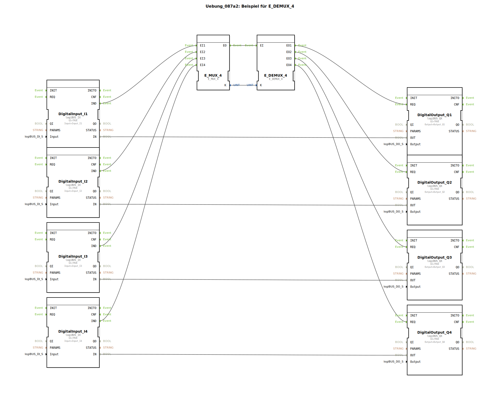

# Uebung_087a2: Beispiel für E_DEMUX_4

* * * * * * * * * *

## Einleitung
Diese Übung demonstriert die Funktionsweise des E_DEMUX_4 Bausteins in der 4diac-IDE. Die Anwendung zeigt, wie Ereignisse über einen Multiplexer und Demultiplexer verteilt werden können, um verschiedene digitale Ausgänge zu steuern.

## Verwendete Funktionsbausteine (FBs)

Die Übung verwendet folgende Haupt-Funktionsbausteine:

- **E_MUX_4**: 4-fach Ereignis-Multiplexer
- **E_DEMUX_4**: 4-fach Ereignis-Demultiplexer
- **DigitalInput_I1-I4**: Digitale Eingänge (logiBUS_IX)
- **DigitalOutput_Q1-Q4**: Digitale Ausgänge (logiBUS_QX)

## Programmablauf und Verbindungen

### Ereignisverbindungen:
- Die IND-Ereignisse der vier digitalen Eingänge (I1-I4) sind mit den entsprechenden Eingängen des E_MUX_4 Bausteins verbunden
- Der Ausgang EO des E_MUX_4 ist mit dem Eingang EI des E_DEMUX_4 verbunden
- Die vier Ausgänge des E_DEMUX_4 (EO1-EO4) sind mit den REQ-Eingängen der entsprechenden digitalen Ausgänge (Q1-Q4) verbunden

### Datenverbindungen:
- Der K-Ausgang des E_MUX_4 ist mit dem K-Eingang des E_DEMUX_4 verbunden
- Jeder digitale Eingang ist direkt mit seinem entsprechenden digitalen Ausgang verbunden (I1→Q1, I2→Q2, I3→Q3, I4→Q4)

### Funktionsweise:
Der E_MUX_4 Baustein sammelt Ereignisse von den vier digitalen Eingängen und leitet sie über einen gemeinsamen Ausgang weiter. Der E_DEMUX_4 Baustein verteilt diese Ereignisse basierend auf dem K-Wert an die entsprechenden digitalen Ausgänge. Die direkten Datenverbindungen zwischen Eingängen und Ausgängen sorgen für eine 1:1-Signalübertragung.

## Lernziele
- Verständnis der Funktionsweise von Multiplexern und Demultiplexern
- Umgang mit Ereignis- und Datenverbindungen in 4diac
- Implementierung von Signalverteilungssystemen
- Anwendung der logiBUS-Schnittstellen für digitale Ein- und Ausgänge

## Schwierigkeitsgrad
Mittel - Grundkenntnisse in 4diac und IEC 61499 werden vorausgesetzt

## Vorkenntnisse
- Grundlagen der IEC 61499 Standard
- Kenntnisse der 4diac-IDE Oberfläche
- Verständnis von Ereignis- und Datenflüssen

## Zusammenfassung
Diese Übung vermittelt praktische Erfahrungen mit Ereignis-Multiplexing und -Demultiplexing in 4diac. Sie zeigt, wie komplexe Signalverteilungen mit den Standard-Bausteinen E_MUX_4 und E_DEMUX_4 realisiert werden können. Die direkte Verbindung zwischen digitalen Ein- und Ausgängen demonstriert gleichzeitig die grundlegende Signalverarbeitung in Automatisierungssystemen.