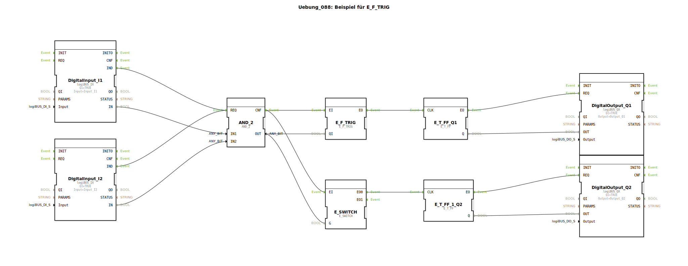

# Uebung_088: Beispiel für E_F_TRIG

Dieser Artikel beschreibt die logiBUS®-Übung `Uebung_088`. Hier wird die gezielte Reaktion auf das Ende eines Signals (Ausschaltflanke) demonstriert.

## 🎧 Podcast

* [Agrar-Revolution 1883: Wie Max Eyth Englands Landwirtschaft modernisierte](https://podcasters.spotify.com/pod/show/ms-muc-lama/episodes/Agrar-Revolution-1883-Wie-Max-Eyth-Englands-Landwirtschaft-modernisierte-e36faae)

----

## Ziel der Übung

Verwendung des Bausteins `E_F_TRIG` (Falling Edge Trigger). Im Gegensatz zum einfachen `E_SWITCH` filtert dieser Baustein alle Ereignisse heraus, außer den Moment des Übergangs von `TRUE` nach `FALSE`.

-----

## Beschreibung und Komponenten

[cite_start]In `Uebung_088.SUB` wird die Reaktion auf eine UND-Logik verglichen[cite: 1].

### Funktionsweise

1.  Zwei Taster `I1` und `I2` werden über ein `AND_2` Gatter verknüpft.
2.  Das Ergebnis (`OUT`) liegt am Eingang `QI` des Flanken-Triggers an.
3.  **Positive Flanke**: Schaltet man die Taster ein, passiert am Ausgang nichts.
4.  **Negative Flanke**: Erst in dem Moment, in dem die UND-Bedingung wieder verloren geht (indem man **einen der beiden** Taster loslässt), feuert `E_F_TRIG.EO`.
5.  Das Flip-Flop toggelt, die Lampe wechselt den Zustand.

-----

## Anwendungsbeispiel

**Sicherheits-Check beim Ausschalten**:
Eine Reinigungsfunktion soll erst dann starten, wenn der Hauptschalter der Maschine ausgeschaltet wurde. Der `F_TRIG` erkennt diesen Ausschalt-Moment und löst den Folgeschritt aus.