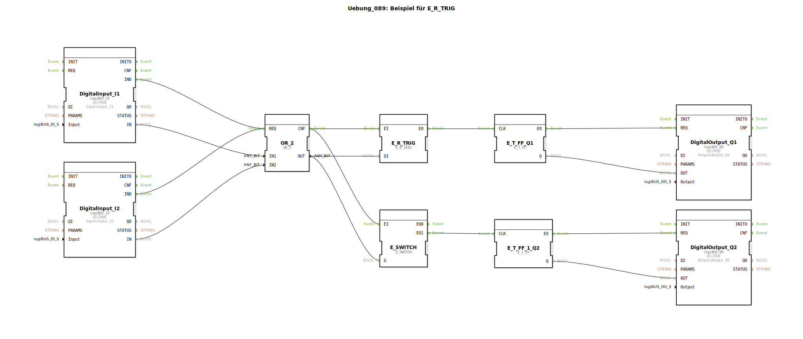

# Uebung_089: Beispiel für E_R_TRIG

Dieser Artikel beschreibt die logiBUS®-Übung `Uebung_089`.

## 🎧 Podcast

* [Apfelwein-Allzweckwaffe und Stickstoff-Revolution: Die Landwirtschaft Mittelfrankens 1892 im Zeitungs-Check](https://podcasters.spotify.com/pod/show/ms-muc-lama/episodes/Apfelwein-Allzweckwaffe-und-Stickstoff-Revolution-Die-Landwirtschaft-Mittelfrankens-1892-im-Zeitungs-Check-e39auu2)

----

## Übersicht

[cite_start]Pendant zur vorherigen Übung unter Verwendung des Bausteins `E_R_TRIG` (Rising Edge Trigger)[cite: 1].
Das Flip-Flop wird hier genau in dem Moment getriggert, in dem eine ODER-Bedingung (`I1 OR I2`) wahr wird. Das bedeutet: Sobald man den **ersten** der beiden Taster drückt, toggelt die Lampe. Das Drücken des zweiten Tasters (während der erste noch gehalten wird) hat keine Auswirkung, da die Logik bereits auf TRUE steht und keine erneute steigende Flanke erzeugt wird.