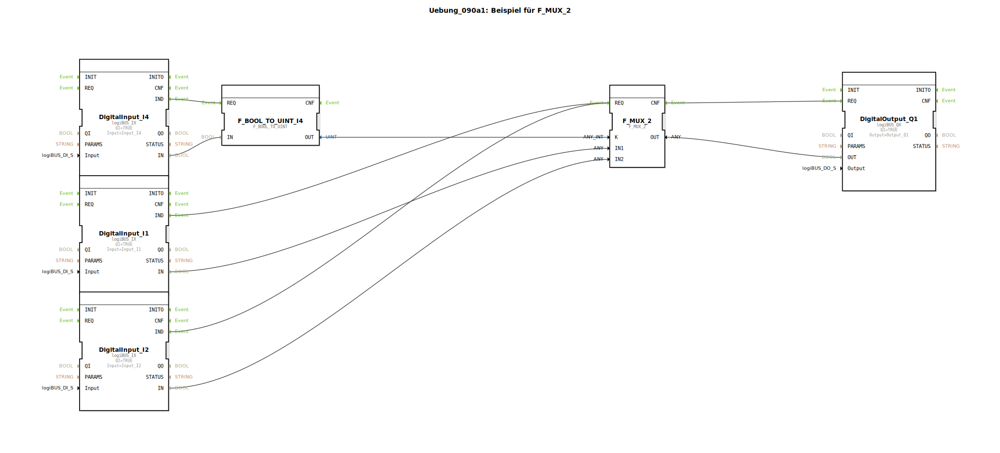

# Uebung_090a1: Beispiel für F_MUX_2

Dieser Artikel beschreibt die logiBUS®-Übung `Uebung_090a1`. Hier wird die Auswahl eines Datenwertes basierend auf einer Adresse demonstriert.

----

## Ziel der Übung

Verwendung des Bausteins `F_MUX_2` (Multiplexer). Es wird gezeigt, wie man zwischen zwei Signalquellen umschaltet, um einen gemeinsamen Ausgang zu bedienen.

-----

## Beschreibung und Komponenten

[cite_start]In `Uebung_090a1.SUB` wird ein binärer Wahlschalter genutzt, um zwischen zwei Eingängen umzuschalten[cite: 1].

### Funktionsbausteine (FBs)

  * **`I1` & `I2` (Sources)**: Die Datenquellen.
  * **`I4` (Selector)**: Bestimmt, welche Quelle durchgeschaltet wird.
  * **`F_MUX_2`**: Der Multiplexer-Baustein.

-----

## Funktionsweise

*   Ist Taster **I4** nicht gedrückt (K=0) ➡️ Der Zustand von **I1** wird an den Ausgang `Q1` weitergereicht.
*   Ist Taster **I4** gedrückt (K=1) ➡️ Der Zustand von **I2** wird an den Ausgang `Q1` weitergereicht.

Dies ermöglicht das Umschalten von Bedien-Zuständigkeiten (z.B. zwischen Lokal- und Fernsteuerung).